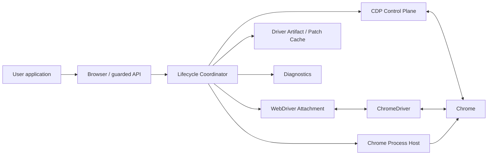

# BrowserDock architecture

- Status: pre-implementation architecture baseline
- Governing specification: [spec.md](spec.md)
- Initial platform: Windows 11 x64, headed Chrome, supported .NET LTS
- Scope: structural and responsibility baseline. Actual implementation and verification are recorded in [implementation.md](implementation.md).

## 1. Purpose

Define the components, their state/resource ownership, and their cooperation during startup, navigation, disconnect, reconnect, and shutdown.

[spec.md](spec.md) governs externally observable requirements and acceptance criteria. This document maps those requirements to an implementable structure. Resolve conflicts by updating both documents in the same change rather than choosing an undocumented interpretation.

## 2. Overview

BrowserDock separates Chrome, CDP, and WebDriver lifetimes in a hybrid architecture.

- **Chrome** is the long-lived process holding browser state and the profile.
- The **CDP control plane** observes, selects, navigates, and recovers browser/page targets.
- A **WebDriver attachment** is a replaceable, short-lived connection providing core W3C commands.
- **Browser** is the aggregate root serializing ownership and state transitions across these layers.

Disconnecting does not terminate the browser. It discards ChromeDriver and the WebDriver session while preserving Chrome and CDP. Reconnection creates a new driver process and session rather than reviving Selenium objects.



## 3. Principles and invariants

Implementation convenience must not weaken these invariants.

1. Chrome, ChromeDriver, and WebDriver sessions have distinct lifetimes.
2. Disconnect terminates only the owned ChromeDriver PID.
3. Reconnect always creates a new process, client, executor, and W3C SessionId.
4. Rotate `AttachmentEpoch` before starting disconnection.
5. Every WebDriver command checks `WebDriverAttached` and the current epoch locally.
6. Raw `IWebDriver`/`IWebElement` never cross the public boundary.
7. Page/runtime CDP commands use an explicit target session.
8. Ambiguous targets fail rather than relying on the latest tab or array order.
9. Original driver binaries are immutable; patch only verified cache copies.
10. Never terminate by process name or unverified PID.
11. User callbacks do not run in transport read loops or under lifecycle locks.
12. Owned-resource cleanup continues within a bounded deadline after cancellation.
13. Do not depend on private Selenium APIs or reflection.
14. Detection evasion on a particular site is not an architecture contract.

## 4. System boundaries

### 4.1 Owned resources

The MVP creates and tracks:

| Resource | Owner | Identity | Final cleanup |
|---|---|---|---|
| Chrome process tree | Library | PID, creation time, canonical executable path | Graceful stop, then force only that tree if needed |
| ChromeDriver process | Attachment | PID, creation time, service port | Terminate on every disconnect |
| Temporary profile | Library | Canonical path, nonce marker | Delete after confirmed Chrome exit |
| Caller-specified profile | Caller | Canonical path, exclusive lock | Release lock; never delete |
| CDP sockets/read loop | Library | Endpoint, connection ID | Bounded drain, then dispose |
| Patch cache | Persistent library data | Source/result hashes, recipe ID | Preserve while running; separate pruning policy |

Attaching to caller-launched Chrome is outside the MVP. Default Chrome profiles are not used.

### 4.2 External dependencies

- Chrome or Chrome for Testing executable.
- Caller-supplied compatible ChromeDriver executable.
- Public Selenium.WebDriver APIs.
- Minimum CDP `Browser`, `Target`, `Page`, and `Runtime` capabilities.
- .NET BCL and `Microsoft.Extensions.Logging` abstractions.
- Windows process, file-locking, and process-tree facilities.

Do not depend on typed Selenium DevTools APIs, internal Selenium Manager paths, or private service APIs.

## 5. Logical components

### 5.1 Public API

`Browser` is the only lifecycle entry point for an instance: state, navigation, target selection, WebDriver leases, advanced CDP, and shutdown.

`WebDriverLease` exposes the guarded `IBrowserCommands` facade, not raw Selenium objects. `ElementRef` holds a locator and lifetime metadata instead of exposing a raw element.

Public models minimize Selenium type exposure so package updates and attachment replacement do not directly contaminate application state.

### 5.2 Lifecycle Coordinator

The coordinator inside `Browser` owns:

- Serialized lifecycle transitions and operations.
- Allocation of the overall deadline to per-stage timeouts.
- Rollback of partially created startup resources.
- Command-admission closure and in-flight draining on disconnect.
- Recovery selection based on Chrome/CDP health.
- Reverse-order final cleanup.

It calls lower-level ports instead of directly handling concrete processes, sockets, or Selenium implementations. Components do not independently mutate global state.

### 5.3 Hosting

`ProfileManager` validates paths, ownership markers, caller-profile locks, and safe cleanup.

`ChromeProcessHost` launches Chrome with a separate user-data directory and `--remote-debugging-port=0`, tracking the exact PID tree. `DevToolsEndpointDiscovery` validates both `DevToolsActivePort` and `/json/version` before accepting an endpoint.

`ProcessTreeTracker` records creation time and executable path as well as PID to prevent PID-reuse mistakes or terminating another session.

### 5.4 CDP Control Plane

CDP has browser and target levels:

- `CdpConnection`: browser WebSocket, JSON-RPC IDs, read/write loops, reconnect, protocol negotiation.
- `TargetRegistry`: target creation/destruction/detach events and `TargetKey` to `targetId` mapping.
- `CdpTargetSession`: ownership of the attached page's `sessionId`.
- `PageNavigator`: target-session navigation and completion conditions.
- `RuntimeScriptRegistry`: logical script IDs and their registered target/sessions.

Send `Browser.*` and `Target.*` through the browser connection. Send `Page.*` and `Runtime.*` with `CdpTargetSession.sessionId`. After transport recovery, enumerate targets, reattach the controlled target, and register scripts again.

`TargetKey` is opaque to callers. When its CDP target disappears, it becomes terminally stale and must never be reassigned to another tab.

### 5.5 WebDriver Attachment

`ChromeDriverProcessHost` selects a candidate service port and launches `--port=N`. It consumes stdout/stderr asynchronously and requires the same PID to remain alive while loopback `/status` reports ready.

`WebDriverAttachmentFactory` uses:

- The current Chrome debugger address.
- No `detach` capability for external Chrome attachment.
- The current session-creation deadline.
- The owned driver PID and service endpoint.

The public `RemoteWebDriver` path supports core W3C commands. Chrome-specific Selenium convenience commands are outside the MVP contract.

`DetachAwareCommandExecutor` forwards normal commands but treats `Quit` as a local success while detaching. Terminating the driver PID before disposing WebDriver prevents dead-endpoint hangs and Chrome shutdown commands.

`AttachmentEpochGuard` checks state and epoch before every facade command. Admitted commands increment the in-flight count and always decrement it on completion.

### 5.6 Patching

`DriverArtifactResolver` reads browser/driver versions and the original hash. `DriverPatchCache` keeps the source immutable and makes a separate temporary copy.

`IDriverPatchStrategy` declares supported versions, exact expected matches per pattern, and recipe ID. Results are promoted atomically with a manifest of source/result hashes, recipe, and match counts. Any mismatch fails startup; do not silently use the unpatched original.

Patching defaults to disabled. Lifecycle/CDP components know only the resulting executable path, not patch internals.

### 5.7 Diagnostics

Every operation has a correlation ID. Structured logs and `BrowserHealthSnapshot` record transitions, PIDs, endpoint discovery, target/session changes, generation/epoch, timeouts, and cleanup.

Default logs omit cookies, storage, page source, script results, and full URLs including queries/fragments. Async boundaries and bounded buffers isolate user callbacks/log sinks from lifecycle execution.

## 6. Dependency direction

Dependencies flow from the public boundary toward concrete implementations.

```text
Public API
    ↓
Application / Lifecycle
    ↓
Ports: Hosting | CDP | WebDriver | Patching | Diagnostics
    ↓
Infrastructure implementations
    ↓
Windows / Chrome / ChromeDriver / Selenium / WebSocket / File system
```

- Public APIs do not reference concrete Selenium or Windows handle types.
- CDP and WebDriver modules do not directly start/stop one another.
- Hosting does not know navigation policy.
- Patching does not launch processes.
- Diagnostics does not mutate business state.
- Only Lifecycle combines components and commits state.

The initial engine can use namespace/internal boundaries in one package/assembly. Native input and the Legacy facade are separate packages. Avoid premature assembly splitting.

## 7. Runtime state model

### 7.1 Aggregate state

Public `BrowserState` represents major lifecycle stages:

- `Stopped`
- `StartingChrome`
- `ChromeReady`
- `AttachingWebDriver`
- `WebDriverAttached`
- `Disconnecting`
- `CdpOnly`
- `Reattaching`
- `Faulted`
- `Disposing`

Track Chrome, CDP transport, attachment, and profile health independently. For example, `CdpOnly` means live Chrome and healthy CDP with no WebDriver attachment.

### 7.2 SessionGeneration and AttachmentEpoch

| Value | Change point | Purpose |
|---|---|---|
| `SessionGeneration` | After successful creation of a W3C session | Successful-session sequence and diagnostics |
| `AttachmentEpoch` | Invalidate immediately on disconnect; commit a new attachment | Lease/element validity |

Generation alone would leave old leases apparently valid between disconnect and successful reconnect. Admission therefore uses state plus epoch.

### 7.3 State commit rules

Do not expose a new state merely because one component succeeded. The coordinator checks every required invariant before committing atomically. `WebDriverAttached` requires:

- The original Chrome PID and creation time.
- A healthy browser CDP connection and controlled target.
- A live ChromeDriver PID with successful `/status` readiness.
- A created W3C session ID.
- An installed guarded executor and new epoch.

## 8. Main execution flows

### 8.1 Startup

1. Validate options, OS/runtime support, binary versions, and profile ownership.
2. Prepare a verified patch-cache copy if requested.
3. Start Chrome and discover `DevToolsActivePort`.
4. Connect browser CDP and record protocol/browser versions.
5. Enable discovery and wait for Chrome's first page within `CdpConnect`. Do not create a replacement tab when the initial list is empty. Select the controlled session for one page; use explicit selection rules for actual multiple pages.
6. Start ChromeDriver separately and verify `/status` readiness.
7. Create a W3C session using debugger address; omit the rejected external-attach `detach` capability.
8. Commit generation/epoch and return `WebDriverAttached`.

On failure, clean up only resources already owned, in reverse order.

### 8.2 Standard navigation

1. Admission checks `WebDriverAttached` and the current epoch.
2. Execute guarded W3C navigation.
3. Map the result URL and error category to facade models.
4. Preserve attachment and generation.

### 8.3 Detached navigation and reconnect

```mermaid
sequenceDiagram
    participant App
    participant L as Lifecycle
    participant G as Epoch Guard
    participant C as CDP Target Session
    participant D as ChromeDriver
    participant W as WebDriver Client

    App->>L: Navigate(Detached, reconnect=true)
    L->>G: close admission; rotate epoch
    L->>G: drain in-flight commands
    L->>C: snapshot controlled target and scripts
    L->>W: executor := detaching
    L->>D: terminate exact owned PID
    L->>W: bounded dispose; Quit is local no-op
    L->>C: Page.navigate + wait milestone
    L->>D: start new PID; verify /status
    L->>W: create new session
    L->>C: re-enumerate and reconcile target
    L->>G: install new attachment; commit epoch/generation
    L-->>App: NavigationResult
```

With `reconnect=false`, remain `CdpOnly` after CDP navigation. Losing Chrome or CDP enters `Faulted`; do not start a new browser automatically.

### 8.4 Explicit disconnect

1. Acquire the lifecycle gate.
2. Immediately rotate epoch and block new WebDriver commands.
3. Drain in-flight commands up to `DisconnectDrain`.
4. Snapshot controlled-target recovery information.
5. Switch the executor to detaching.
6. Terminate the owned ChromeDriver PID.
7. Dispose the stale client/transport with a bound.
8. Probe Chrome PID and target health through CDP.
9. Commit `CdpOnly` if healthy, otherwise `Faulted`.

### 8.5 Reconnect

1. Verify `CdpOnly` and Chrome/CDP health.
2. Refresh the registry and verify the controlled target exists.
3. Create a new driver process and session.
4. Reconcile the target and WebDriver current context.
5. Fail with `AmbiguousTarget` rather than guessing.
6. Increment generation and commit the new epoch only on success.

### 8.6 Final shutdown

Unlike disconnect, `StopAsync`/`DisposeAsync` also terminate library-owned Chrome.

1. Close new lifecycle/command admission and invalidate epoch.
2. Drain in-flight commands with a bound.
3. Clean up any attachment with the detaching executor and exact driver PID.
4. Request graceful Chrome shutdown and wait within the deadline.
5. If needed, force only the recorded owned process tree.
6. Stop CDP read loops, event channels, and sockets.
7. Drain background tasks/subscriptions.
8. Release caller-profile locks.
9. Delete only temporary profiles with matching markers.
10. Record remaining PIDs, ports, handles, and cleanup failures in final health.

Caller cancellation may hasten entry to shutdown, but cleanup continues in a separate scope for up to ten seconds.

## 9. Concurrency model

### 9.1 Lifecycle gate

After startup, navigation/disconnect/reconnect/stop use one async gate per instance. Waiting operations retain their own cancellation and overall deadlines.

Stop takes precedence over queued new operations; later requests fail promptly with `ObjectDisposed` or a state error.

### 9.2 WebDriver command admission

1. Check current state and lease epoch.
2. Increment the in-flight count if admission is open.
3. Recheck epoch immediately to close the disconnect race.
4. Execute the Selenium command.
5. Decrement in `finally`.

Disconnect closes admission, rotates epoch, and waits a bounded time for zero in-flight commands. On timeout, terminate the attachment process and normalize results to `AttachmentLost`.

### 9.3 CDP transport and events

Multiplex requests/responses with numeric IDs. Per-target queues preserve target-mutation/navigation order.

Read loops only parse messages and publish internally. Run user handlers/log sinks on another scheduler. Overflow may discard older observation events according to policy, but must not discard target lifecycle events; mark the connection unhealthy instead.

## 10. Errors and recovery boundaries

Classify errors by the action available to callers, not their implementation location.

| Category | Default recovery | Resulting state |
|---|---|---|
| Configuration/version/patch | None | `Stopped` or `Faulted` |
| Driver startup/session failure | Clean exact PID, apply retry limit | `CdpOnly` if Chrome/CDP healthy |
| Attached transport failure | Invalidate epoch, remove attachment | `CdpOnly` or `Faulted` |
| CDP socket loss | One attempt on the same Chrome endpoint | Preserve major state on success |
| Target close/crash | No automatic target switch | Explicit target error |
| Chrome exit | No automatic browser restart | `Faulted` |
| Incomplete cleanup | Preserve residual-resource diagnostics | `Faulted` |

Automatic recovery is limited to CDP reconnection followed by attachment recreation. Chrome restart and profile-state migration are later opt-in features.

## 11. Timeouts and cancellation

Every public async call creates an operation deadline. Each stage uses `min(stage default, operation time remaining, caller deadline)`.

Run synchronous WebDriver session creation and Selenium commands on dedicated work. After a deadline, do not assume cancellation stopped them: terminate the exact driver PID to break I/O, then probe Chrome through CDP.

Cleanup has a separate token and ten-second hard cap. See [specification section 14.1](spec.md#141-timeouts-and-cancellation) for baseline values.

## 12. Data and persistence

The MVP has no server database.

### 12.1 In-memory state

- Lifecycle state and operation ID.
- Separate Chrome/CDP/WebDriver health.
- PID/creation time/path and endpoints.
- Target registry and sessions.
- Runtime script registry.
- Session generation and attachment epoch.
- In-flight commands and background tasks.

### 12.2 Files

- Temporary or caller-specified Chrome profiles.
- Ownership markers and profile locks.
- Immutable source-driver metadata.
- Patched-driver cache and manifests.
- Optional diagnostic files.

Markers/manifests carry schema versions. Older implementations must not modify/delete unknown newer schemas. Do not copy sensitive browser storage into separate library files.

## 13. Security boundaries

- Bind DevTools/driver endpoints to loopback only.
- Treat endpoint addresses and profile paths as sensitive diagnostics.
- Reject default/shared profiles.
- Record canonical executable paths, versions, and hashes.
- If archive extraction is added, reject path traversal and unexpected entries.
- Terminate only after matching recorded PID/creation time/path.
- Minimize patch-cache execute/write permissions and publish atomically.
- Isolate arbitrary CDP as an advanced feature; retain URL allowlists and redacted logs.

Detection evasion, authentication bypass, and automatic CAPTCHA solving are not trust boundaries or success criteria.

## 14. Observability

Where available, each log event records:

- Library/browser/driver/Selenium/protocol versions.
- Browser instance and operation IDs.
- Previous/next lifecycle states.
- Generation and epoch.
- Chrome/driver PIDs and redacted endpoints.
- Target key and reasons for target/session changes.
- Stage, elapsed time, and timeout source.
- Recovery attempts and cleanup results.

Health snapshots expose separate Chrome/CDP/WebDriver/profile/background-task status, not one connected flag. Include real process/endpoint probes and last-success times rather than trusting internal flags alone.

## 15. Suggested source and package layout

This proposal describes boundaries and test placement; it is not an instruction to create these projects now.

```text
src/
  BrowserDock/                  public API and lifecycle orchestration
  BrowserDock.Cdp/              minimal CDP transport/target/page/runtime
  BrowserDock.Selenium/         guarded W3C attachment adapter
  BrowserDock.Windows/          process/profile/lock implementation
  BrowserDock.Patching/         artifact validation and optional patching
tests/
  BrowserDock.UnitTests/
  BrowserDock.ContractTests/
  BrowserDock.WindowsTests/
  BrowserDock.LeakTests/
```

Packages need not map one-to-one to projects. Reserve `BrowserDock.NativeInput` for later. Implement optional `BrowserDock.Legacy` for C# 7.3/Framework 4.8.1. Core and Legacy both target `net481;net8.0;net10.0`; Legacy only converts options/results/exceptions through a Task facade. Keep the Hosting/CDP/WebDriver engine and state machine in Core. Centralize Framework compatibility in `Compatibility.cs` and keep compiler helper types internal. See the [Framework guide](framework481.md).

## 16. Test architecture

### 16.1 Unit-test seams

- Clock/deadline source.
- Process launcher/probe.
- Filesystem/profile lock.
- CDP transport/event stream.
- Driver status endpoint.
- WebDriver executor.
- Patch recipe/hash provider.
- Logging/event sinks.

Process/socket substitutes quickly verify state and cleanup ordering, but do not replace browser acceptance.

### 16.2 Contract tests

- Public construction/execution/disposal with the pinned Selenium package.
- Used CDP methods/event shapes per Chrome major.
- Driver `/status` and W3C new-session responses.
- Pattern counts/result hashes for patch fixtures.

### 16.3 Windows integration

Primary release gates:

1. Preserve the same Chrome PID and CDP endpoint after disconnect.
2. Reconnect with a new W3C SessionId and preserved browser state.
3. Reject old leases/elements locally as soon as disconnect starts.
4. No owned-process/port/socket/task/profile leaks after repetition.
5. Consistent target/session events with simultaneous CDP and ChromeDriver connections.

Use the numbers and repetition counts in [specification section 20](spec.md#20-verifiable-acceptance-criteria).

## 17. Architecture decisions

| Decision | Choice | Reason | Revisit when |
|---|---|---|---|
| Control | Long-lived CDP + replaceable WebDriver | Browser control while disconnected, plus W3C commands | Acceptance reveals simultaneous-client conflicts |
| Reconnect | New attachment | Avoid Selenium reinitialization/reflection | An official reusable-attachment API exists |
| Public WebDriver | Guarded facade | Prevent epoch/lifecycle bypass | Safe raw proxy and complete interception are proven |
| Stale guard | State + epoch | Immediate disconnect invalidation | Never; core invariant |
| Target selection | Explicit `TargetKey` | Avoid window-order mistakes | Standard WebDriver/CDP identity exists |
| Driver lifecycle | Own child process | Control PID/readiness/cancellation/cleanup | Public Selenium service APIs provide equivalent control |
| Binary patch | Off by default, separate strategy | Isolate version risk | Stable official alternative or feature removal |
| External Chrome attach | Outside MVP | Unclear process/profile ownership and security | Separate API and acceptance tests are designed |
| Native input | Later separate package | Desktop/DPI/RDP dependence | Clear demand and dedicated CI |

## 18. Pre-implementation validation questions

Validate these architecture assumptions on a real Windows fixture first:

1. Does omitting detach, blocking Quit, and terminating the driver PID reliably preserve Chrome?
2. Does `DetachAwareCommandExecutor` sync/async disposal finish within the hard cap against a dead endpoint?
3. Do independent CDP and ChromeDriver connections coexist without disrupting target events/navigation?
4. Can reconnected WebDriver be deterministically reconciled with the controlled CDP target?
5. Which debugger-attach commands are unsupported for each supported version?
6. Do optional recipes match the declared count and remain executable on real Stable/Stable-1 binaries?

If questions 1–4 invalidate the design, revise the architecture decisions and the specification's requirements/state diagrams/acceptance criteria together rather than hiding the discrepancy in implementation workarounds.
