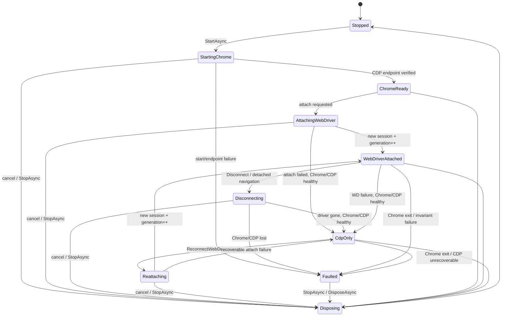

# BrowserDock 개발 명세

- 문서 상태: 조사 및 3개 독립 정적 검증 반영 초안
- 조사 기준일: 2026-09-08 (Asia/Seoul)
- 초기 대상: Windows 11 x64, Google Chrome/Chrome for Testing, 지원 중인 .NET LTS
- 구현 상태: MVP 코드와 자동화 시험을 추가했다. 현재 실행 결과와 Windows 수용 시험의 미검증 항목은 [implementation.md](implementation.md)에 기록한다. 탐지 사이트 대상 실험은 수행하지 않았다.
- 관련 문서: [architecture.md](architecture.md)

## 1. 사실·제안·가정 표기

이 문서는 다음 표기를 사용한다.

- **확인된 사실**: 고정 커밋의 실제 소스 또는 공식 문서로 확인한 내용이다.
- **설계 결정**: BrowserDock에 권장하는 구조 또는 동작이다. 참조 프로젝트의 현재 동작과 같다는 뜻은 아니다.
- **미검증 가정**: 정적 분석으로는 확정할 수 없으며 구현 단계에서 실행 검증해야 한다.

특정 사이트, CAPTCHA, WAF 또는 봇 탐지 제품에 대한 통과를 제품 요구사항이나 보증으로 삼지 않는다. “UC 호환형”은 수명주기와 호출 패턴의 호환성을 뜻하며 탐지 회피 성공을 뜻하지 않는다.

## 2. 조사 범위와 고정 버전

### 2.1 분석한 저장소

| 대상 | 브랜치/태그 | 커밋 SHA | 용도 |
|---|---|---|---|
| SeleniumBase | `master` | [`4ee7dfc4ae83c19385f5ac129f2cda0cfa863d80`](https://github.com/seleniumbase/SeleniumBase/commit/4ee7dfc4ae83c19385f5ac129f2cda0cfa863d80) | 현재 UC Mode와 CDP Mode 호출 경로 |
| fysh711426/UndetectedChromeDriver | `master` | [`1c7042a337db3ca2beca27f440ca36deedb99e7a`](https://github.com/fysh711426/UndetectedChromeDriver/commit/1c7042a337db3ca2beca27f440ca36deedb99e7a) | 기존 C# 구현 비교 |
| Selenium | `trunk` | [`1303bd5282e36adb47c4605792e48a61c12752c7`](https://github.com/SeleniumHQ/selenium/commit/1303bd5282e36adb47c4605792e48a61c12752c7) | 현재 .NET 공개/비공개 API와 CDP 범위 |
| Selenium | `selenium-4.44.0` | [`da2039bd1456a161d0c284de16f9f4f179f1e8ca`](https://github.com/SeleniumHQ/selenium/commit/da2039bd1456a161d0c284de16f9f4f179f1e8ca) | 기존 C# 패키지가 고정한 버전의 reflection 호환성 확인 |

GitHub 이슈 [SeleniumBase #2563](https://github.com/seleniumbase/SeleniumBase/issues/2563)은 2024-03-04에 작성되었다. 질문자는 패치된 드라이버만 .NET에서 사용했을 때와 SeleniumBase UC navigation의 결과가 달랐으며 .NET/VB 바인딩을 문의했다. 이슈에는 구현을 설명하는 유지관리자 답변이나 공식 .NET 바인딩이 없다. 따라서 이 이슈는 문제 제기와 조사 출발점일 뿐, 기술 명세의 근거로 사용하지 않는다.

### 2.2 공식 문서 기준

- ChromeDriver는 `goog:chromeOptions.debuggerAddress`로 이미 실행 중인 Chrome에 연결할 수 있다. 다만 이 방식에서는 시작 시 automation extension이 로드되지 않아 창 크기 변경 같은 일부 WebDriver 명령이 지원되지 않는다. [ChromeDriver 제한 문서](https://developer.chrome.com/docs/chromedriver/help/operation-not-supported-when-using-remote-debugging)
- Chrome 136부터 일반 Chrome의 기본 사용자 데이터 디렉터리에는 `--remote-debugging-port`/`--remote-debugging-pipe`가 적용되지 않는다. 별도의 `--user-data-dir`가 필요하며, 자동화에는 Chrome for Testing 사용이 권장된다. [Chrome 원격 디버깅 변경](https://developer.chrome.com/blog/remote-debugging-port)
- CDP는 테스트용 안정 표준이 아니고 브라우저 버전에 강하게 의존하며, Selenium도 CDP 지원을 WebDriver BiDi가 완성될 때까지의 임시 지원으로 설명한다. [.NET 예제를 포함한 Selenium CDP 문서](https://www.selenium.dev/documentation/webdriver/bidi/cdp/)
- Chrome/ChromeDriver 115 이상은 Chrome for Testing(CfT) 릴리스 및 JSON endpoint로 버전을 맞춘다. 시스템 Chrome을 쓸 때는 `MAJOR.MINOR.BUILD`의 latest patch, 없으면 milestone endpoint 순서로 해석한다. [ChromeDriver 버전 선택](https://developer.chrome.com/docs/chromedriver/downloads/version-selection)
- 2026-09-08 현재 지원 중인 LTS는 .NET 8과 .NET 10이다. .NET 8은 2026-11-10, .NET 10은 2028-11-14 지원 종료 예정이다. [.NET 공식 지원 정책](https://dotnet.microsoft.com/en-us/platform/support/policy)

### 2.3 독립 정적 검증

초안은 2026-09-08에 세 관점으로 교차 검증했다. 첫 검증은 SeleniumBase 호출 경로와 permalink를, 둘째는 Selenium .NET 공개 API와 기존 C# 구현을, 셋째는 상태·소유권·수용 기준의 완결성을 점검했다. 이 검증은 소스와 문서의 정적 검토이며 Windows 실행 검증을 대신하지 않는다. 지적 사항은 본문에 반영했고, 실행으로만 확정할 수 있는 항목은 §21에 남겼다.

## 3. 핵심 결론

**설계 결정:** BrowserDock은 **CDP를 장수명 제어면(control plane)** 으로 두고, **Selenium WebDriver는 교체 가능한 단기 attachment** 로 두는 하이브리드 구조를 채택한다.

이 구조의 핵심은 다음과 같다.

1. 라이브러리가 Chrome을 별도 프로세스로 시작하고 고유 프로필과 loopback DevTools endpoint를 소유한다.
2. 독립 CDP 연결이 Chrome/target 상태, navigation, 런타임 스크립트 및 복구 정보를 관리한다.
3. WebDriver가 필요할 때 별도 ChromeDriver 프로세스를 시작하여 `debuggerAddress`로 기존 Chrome에 새 세션을 붙인다.
4. disconnect는 Chrome이 아니라 ChromeDriver 프로세스와 WebDriver attachment만 종료한다.
5. reconnect는 같은 Selenium 객체를 재사용하지 않고 새 ChromeDriver, 새 WebDriver 객체, 새 WebDriver session을 만든다. 성공할 때마다 `SessionGeneration`을 증가시킨다.
6. disconnect가 시작되는 순간 `AttachmentEpoch`를 바꿔 이전 element와 lease를 원격 호출 전에 무효화한다. `SessionGeneration`은 성공한 session의 번호로 별도 유지한다.

이 선택은 SeleniumBase의 “Chrome 별도 실행 + debuggerAddress attach + 드라이버 서비스 중단 중 navigation + 새 session 생성”이라는 UC 핵심을 보존하면서, Python 동적 monkey patch와 Selenium 비공개 API 의존성을 제거한다.

## 4. SeleniumBase 실제 호출 경로

**확인된 사실:** 공개 생성 경로는 `get_driver()` → `get_local_driver()` → `undetected.Chrome(...)` → UC 메서드 monkey patch → `extend_driver()` 순서다. 진입과 UC 인수 전달은 [`browser_launcher.py` L3047-L3105](https://github.com/seleniumbase/SeleniumBase/blob/4ee7dfc4ae83c19385f5ac129f2cda0cfa863d80/seleniumbase/core/browser_launcher.py#L3047-L3105), local driver 선택은 [`browser_launcher.py` L3588-L3612](https://github.com/seleniumbase/SeleniumBase/blob/4ee7dfc4ae83c19385f5ac129f2cda0cfa863d80/seleniumbase/core/browser_launcher.py#L3588-L3612), 최종 확장은 [`browser_launcher.py` L6071-L6073](https://github.com/seleniumbase/SeleniumBase/blob/4ee7dfc4ae83c19385f5ac129f2cda0cfa863d80/seleniumbase/core/browser_launcher.py#L6071-L6073)에 있다.

### 4.1 초기화와 바이너리 패치

**확인된 사실:** `browser_launcher.get_local_driver()`의 UC 분기는 `undetected.Chrome(...)`을 생성한다. `SessionNotCreatedException`일 때만 같은 options로 한 번 재시도하며, URL 관련 예외에는 macOS 인증서 안내라는 별도 처리가 있다. 호출부는 [`browser_launcher.py` L5680-L5719](https://github.com/seleniumbase/SeleniumBase/blob/4ee7dfc4ae83c19385f5ac129f2cda0cfa863d80/seleniumbase/core/browser_launcher.py#L5680-L5719)에 있다.

`undetected.Chrome.__init__()`의 실제 순서는 다음과 같다.

1. 프로세스 간 lock 안에서 `Patcher.auto()`를 호출한다. [`undetected/__init__.py` L122-L133](https://github.com/seleniumbase/SeleniumBase/blob/4ee7dfc4ae83c19385f5ac129f2cda0cfa863d80/seleniumbase/undetected/__init__.py#L122-L133)
2. 원격 디버깅 포트를 선택하고 `options.debugger_address` 및 Chrome 인수를 함께 설정한다. [`undetected/__init__.py` L146-L180](https://github.com/seleniumbase/SeleniumBase/blob/4ee7dfc4ae83c19385f5ac129f2cda0cfa863d80/seleniumbase/undetected/__init__.py#L146-L180)
3. 사용자 지정 프로필은 보존하고, 없으면 임시 프로필을 만든다. [`undetected/__init__.py` L181-L237](https://github.com/seleniumbase/SeleniumBase/blob/4ee7dfc4ae83c19385f5ac129f2cda0cfa863d80/seleniumbase/undetected/__init__.py#L181-L237)
4. Chrome을 `subprocess.Popen`으로 먼저 시작한 뒤 Selenium의 Chrome WebDriver 생성자를 호출한다. 이때 ChromeDriver는 새 Chrome을 띄우는 대신 `debuggerAddress`로 이미 실행 중인 Chrome에 붙는다. [`undetected/__init__.py` L279-L364](https://github.com/seleniumbase/SeleniumBase/blob/4ee7dfc4ae83c19385f5ac129f2cda0cfa863d80/seleniumbase/undetected/__init__.py#L279-L364)

`Patcher.auto()`는 사용자 지정 executable이면 패치 여부를 확인하고 필요한 경우에만 패치한다. 자동 관리 경로는 브라우저 milestone에 맞춰 드라이버를 받은 뒤 패치한다. [`patcher.py` L79-L123](https://github.com/seleniumbase/SeleniumBase/blob/4ee7dfc4ae83c19385f5ac129f2cda0cfa863d80/seleniumbase/undetected/patcher.py#L79-L123)

현재 패치는 ChromeDriver 바이너리에서 두 종류의 `window.cdc_*` 대입/논리식 패턴과 한 종류의 `'$cdc_*';` 문자열 리터럴을 길이가 보존되는 newline 또는 임의 문자열로 치환한다. `is_binary_patched()`는 고정된 과거 CDC marker 하나만 검사하고, `patch_exe()`는 match가 0개여도 성공을 반환할 수 있어 오탐 위험이 있다. [`patcher.py` L201-L247](https://github.com/seleniumbase/SeleniumBase/blob/4ee7dfc4ae83c19385f5ac129f2cda0cfa863d80/seleniumbase/undetected/patcher.py#L201-L247)

**설계 결정:** BrowserDock 패처는 원본을 in-place 수정하지 않는다. 원본 SHA-256과 드라이버 버전을 키로 별도 캐시 사본을 만들고, 예상 match 수가 정확하지 않으면 fail-closed한다. 프로세스 간 named mutex와 원자적 rename을 사용한다. 패치 recipe는 ChromeDriver 버전 범위별로 버전 관리한다.

### 4.2 런타임 JavaScript 처리와 `get()` 교체

**확인된 사실:** `undetected.Chrome.get()`은 현재 문서의 own/prototype 전역 속성에서 CDC형 이름 패턴을 찾고, 다음 문서 시작 시 해당 속성을 삭제하는 `Page.addScriptToEvaluateOnNewDocument` 스크립트를 등록한 뒤 Selenium `get()`을 호출한다. [`undetected/__init__.py` L381-L439](https://github.com/seleniumbase/SeleniumBase/blob/4ee7dfc4ae83c19385f5ac129f2cda0cfa863d80/seleniumbase/undetected/__init__.py#L381-L439)

그 다음 `browser_launcher`는 이 UC `get`을 `default_get`에 보관하고, 공개 `driver.get`을 `uc_special_open_if_cf`로 교체한다. [`browser_launcher.py` L5913-L5928](https://github.com/seleniumbase/SeleniumBase/blob/4ee7dfc4ae83c19385f5ac129f2cda0cfa863d80/seleniumbase/core/browser_launcher.py#L5913-L5928) 따라서 SeleniumBase에서 `default_get`은 순수 Selenium 원본이 아니라 이미 CDC 처리가 들어간 UC `get`이다.

기본 교체 `get()`은 대상 URL에 별도 HTTP 요청을 먼저 보내 상태 코드, CAPTCHA/Cloudflare 관련 문자열을 검사한다. “special”이고 `cdp_base`가 없을 때만 새 탭을 JavaScript로 열고 이전 탭을 닫은 뒤 reconnect하며, `cdp_base`가 있거나 special이 아니면 `default_get`을 호출한다. [`browser_launcher.py` L489-L557](https://github.com/seleniumbase/SeleniumBase/blob/4ee7dfc4ae83c19385f5ac129f2cda0cfa863d80/seleniumbase/core/browser_launcher.py#L489-L557)

**설계 결정:** BrowserDock MVP는 이 HTTP 사전 요청과 사이트별 challenge 문자열 판별을 복제하지 않는다. 별도 HTTP 클라이언트의 쿠키/TLS/프록시 상태는 실제 Chrome과 다르고 요청을 중복시키며 사이트별 유지보수 부담이 크다. 대신 호출자가 `Standard` 또는 `Detached` navigation을 명시적으로 선택한다. 휴리스틱 policy는 후속 확장점으로만 둔다.

### 4.3 navigation 분기

| SeleniumBase 경로 | 실제 동작 | BrowserDock 대응 |
|---|---|---|
| `get()` | HTTP 사전 탐지 후 일반 WebDriver navigation 또는 새 탭/reconnect | MVP에서 자동 사전 탐지 제외; 명시적 policy |
| `uc_open()` | CDP Mode이면 CDP `get`; 아니면 `setTimeout`으로 `window.location.href`를 예약하고 context exit에서 reconnect | `NavigateAsync(url, Mode=Standard/Detached)` |
| `uc_open_with_tab()` | 새 탭을 JS/CDP로 열고 기존 탭을 닫은 뒤 최신 창 선택 | `NavigateAsync(url, Mode=Detached, TargetPolicy=ReplaceControlled)` |
| `uc_open_with_reconnect()` | 새 탭 생성, 이전 탭 close 후 disconnect 또는 reconnect; 최신 창 선택은 reconnect 분기에만 수행 | `NavigateAsync(url, Mode=Detached, ReconnectAfterNavigation=true/false)` |
| `uc_open_with_disconnect()` | 새 탭 생성/이전 탭 close 후 ChromeDriver만 disconnect | `NavigateAsync(url, Mode=Detached, ReconnectAfterNavigation=false)` |
| `uc_activate_cdp_mode()` | WebDriver를 disconnect하고 별도 CDP driver를 같은 host/port에 연결 | `EnterCdpOnlyAsync()` |

근거:

- `uc_open`, 새 탭 및 reconnect 분기: [`browser_launcher.py` L560-L641](https://github.com/seleniumbase/SeleniumBase/blob/4ee7dfc4ae83c19385f5ac129f2cda0cfa863d80/seleniumbase/core/browser_launcher.py#L560-L641)
- `uc_open_with_disconnect`: [`browser_launcher.py` L1016-L1042](https://github.com/seleniumbase/SeleniumBase/blob/4ee7dfc4ae83c19385f5ac129f2cda0cfa863d80/seleniumbase/core/browser_launcher.py#L1016-L1042)
- `window.setTimeout`을 사용하는 helper: [`js_utils.py` L401-L404](https://github.com/seleniumbase/SeleniumBase/blob/4ee7dfc4ae83c19385f5ac129f2cda0cfa863d80/seleniumbase/fixtures/js_utils.py#L401-L404)

### 4.4 disconnect/reconnect와 session 재생성

**확인된 사실:** SeleniumBase `disconnect()`는 Selenium client와 ChromeDriver service의 종료를 시도하지만 별도 Chrome 프로세스는 종료하지 않는다. 관련 예외를 대부분 억제한 뒤 `_is_connected` flag를 설정하므로, flag만으로 실제 종료 또는 연결 건강성을 증명하지는 않는다. [`undetected/__init__.py` L532-L547](https://github.com/seleniumbase/SeleniumBase/blob/4ee7dfc4ae83c19385f5ac129f2cda0cfa863d80/seleniumbase/undetected/__init__.py#L532-L547)

`reconnect()`는 service 종료, 대기, service 재시작과 `start_session()`을 순서대로 시도한다. `connect()`도 service 시작 후 새 session 생성을 시도한다. 이들 역시 예외 억제와 내부 flag 갱신이 있어 실제 건강성은 별도 확인이 필요하다. [`undetected/__init__.py` L480-L530](https://github.com/seleniumbase/SeleniumBase/blob/4ee7dfc4ae83c19385f5ac129f2cda0cfa863d80/seleniumbase/undetected/__init__.py#L480-L530), [`undetected/__init__.py` L549-L596](https://github.com/seleniumbase/SeleniumBase/blob/4ee7dfc4ae83c19385f5ac129f2cda0cfa863d80/seleniumbase/undetected/__init__.py#L549-L596)

Python context manager의 `__exit__`는 일반 WebDriver처럼 quit하지 않고 reconnect한다. [`undetected/__init__.py` L690-L695](https://github.com/seleniumbase/SeleniumBase/blob/4ee7dfc4ae83c19385f5ac129f2cda0cfa863d80/seleniumbase/undetected/__init__.py#L690-L695) 이 때문에 navigation 함수의 `with driver:`가 reconnect 경계로 동작한다.

**설계 결정:** BrowserDock은 이 동작을 `using`/`Dispose` 의미로 옮기지 않는다. .NET의 `Dispose`는 최종 자원 해제를 뜻해야 한다. reconnect 경계는 이름이 명확한 async 메서드로만 제공한다.

### 4.5 CDP Mode는 UC navigation과 별개다

**확인된 사실:** CDP Mode 활성화는 먼저 WebDriver를 disconnect한 다음 같은 debugger endpoint에 `cdp_util.start(host, port, ...)`로 직접 연결한다. 이후 page/element/action 메서드를 CDP 구현으로 대량 매핑하고 `_is_using_cdp = True`로 표시한다. [`browser_launcher.py` L644-L752](https://github.com/seleniumbase/SeleniumBase/blob/4ee7dfc4ae83c19385f5ac129f2cda0cfa863d80/seleniumbase/core/browser_launcher.py#L644-L752), [`browser_launcher.py` L970-L1002](https://github.com/seleniumbase/SeleniumBase/blob/4ee7dfc4ae83c19385f5ac129f2cda0cfa863d80/seleniumbase/core/browser_launcher.py#L970-L1002)

`cdp_util.start()`는 host와 port가 모두 주어지면 새 Chrome을 시작하지 않고 기존 debuggable session에 연결한다고 명시한다. [`cdp_util.py` L288-L349](https://github.com/seleniumbase/SeleniumBase/blob/4ee7dfc4ae83c19385f5ac129f2cda0cfa863d80/seleniumbase/undetected/cdp_driver/cdp_util.py#L288-L349)

즉 다음은 서로 다르다.

- **UC Mode:** 패치된 ChromeDriver와 WebDriver API가 기본이며 필요할 때 driver service를 잠시 끊는다.
- **CDP Mode:** WebDriver가 끊긴 상태에서 별도 CDP client가 지속적으로 Chrome을 제어한다.

BrowserDock은 둘을 하나의 “stealth mode” boolean으로 합치지 않고 `WebDriverAttached`와 `CdpOnly` 상태로 구분한다.

SeleniumBase의 고수준 메서드 중 CDP 대체 구현이 있는 메서드는 WebDriver가 끊긴 동안 CDP 구현으로 dispatch한다. 반면 monkey-patch된 raw `execute_cdp_cmd`는 먼저 WebDriver를 reconnect한 뒤 Selenium의 CDP command를 호출한다. [`browser_launcher.py` L472-L480](https://github.com/seleniumbase/SeleniumBase/blob/4ee7dfc4ae83c19385f5ac129f2cda0cfa863d80/seleniumbase/core/browser_launcher.py#L472-L480), [`browser_launcher.py` L6011-L6016](https://github.com/seleniumbase/SeleniumBase/blob/4ee7dfc4ae83c19385f5ac129f2cda0cfa863d80/seleniumbase/core/browser_launcher.py#L6011-L6016) 또한 일부 일반 Selenium 호출 경로는 연결 상태를 보고 자동 reconnect할 수 있다. [`shared_utils.py` L148-L171](https://github.com/seleniumbase/SeleniumBase/blob/4ee7dfc4ae83c19385f5ac129f2cda0cfa863d80/seleniumbase/fixtures/shared_utils.py#L148-L171)

**미검증 가정:** BrowserDock이 제안하는 “독립 CDP 연결을 WebDriver attachment와 동시에 계속 유지”하는 구조는 SeleniumBase가 입증한 동작이 아니다. SeleniumBase CDP Mode는 WebDriver를 먼저 disconnect한다. 구현 단계에서는 CDP와 ChromeDriver가 동시에 target discovery, navigation 및 Runtime script를 다룰 때 event 손실·target/session 충돌이 없는지 별도 통합 시험해야 한다.

### 4.6 요소와 GUI 입력

**확인된 사실:** SeleniumBase `WebElement.uc_click()`은 일부 tag에서 지연된 DOM click을 예약하지만, 나머지 tag에서는 즉시 `js_click()`한 뒤 reconnect한다. 상위 `uc_click()`도 element를 다시 찾고 interception 시 즉시 JS click 후 reconnect로 fallback한다. [`undetected/webelement.py` L7-L38](https://github.com/seleniumbase/SeleniumBase/blob/4ee7dfc4ae83c19385f5ac129f2cda0cfa863d80/seleniumbase/undetected/webelement.py#L7-L38), [`browser_launcher.py` L1045-L1078](https://github.com/seleniumbase/SeleniumBase/blob/4ee7dfc4ae83c19385f5ac129f2cda0cfa863d80/seleniumbase/core/browser_launcher.py#L1045-L1078)

GUI 입력은 WebDriver/CDP input과 별개이며 `pyautogui` 및 프로세스 간 GUI lock을 사용한다. Windows 좌표 click은 필요 시 reconnect하고 WebDriver/CDP 창 위치와 크기, 화면 비율을 이용해 좌표를 보정한다. [`browser_launcher.py` L1274-L1329](https://github.com/seleniumbase/SeleniumBase/blob/4ee7dfc4ae83c19385f5ac129f2cda0cfa863d80/seleniumbase/core/browser_launcher.py#L1274-L1329) CAPTCHA click 흐름은 GUI click 직전에 disconnect하고 이후 reconnect한다. [`browser_launcher.py` L1677-L1745](https://github.com/seleniumbase/SeleniumBase/blob/4ee7dfc4ae83c19385f5ac129f2cda0cfa863d80/seleniumbase/core/browser_launcher.py#L1677-L1745)

**설계 결정:** Win32 `SendInput` 기반 GUI 입력은 후속 선택 모듈로 분리한다. headed Chrome, interactive desktop, foreground window, DPI/좌표 변환, RDP 잠금, UAC 경계, 전역 입력 직렬화가 모두 검증된 경우에만 동작시킨다. CAPTCHA 전용 API나 자동 풀이 API는 제공하지 않는다.

## 5. 기존 C# 구현 비교

### 5.1 구현된 기능

고정 커밋의 `Selenium.UndetectedChromeDriver` 1.1.4는 다음을 구현한다.

이 버전은 `Selenium.WebDriver` 4.44.0을 직접 참조한다. [`UndetectedChromeDriver.csproj` L47-L50](https://github.com/fysh711426/UndetectedChromeDriver/blob/1c7042a337db3ca2beca27f440ca36deedb99e7a/UndetectedChromeDriver/UndetectedChromeDriver.csproj#L47-L50)

- 지정 ChromeDriver 바이너리를 in-place 패치한다. [`Patcher.cs` L17-L79](https://github.com/fysh711426/UndetectedChromeDriver/blob/1c7042a337db3ca2beca27f440ca36deedb99e7a/UndetectedChromeDriver/Patcher.cs#L17-L79)
- 빈 디버깅 포트를 선택하고 Chrome을 별도로 시작한 뒤 `ChromeOptions.DebuggerAddress`로 ChromeDriver를 붙인다. [`UndetectedChromeDriver.cs` L85-L113](https://github.com/fysh711426/UndetectedChromeDriver/blob/1c7042a337db3ca2beca27f440ca36deedb99e7a/UndetectedChromeDriver/UndetectedChromeDriver.cs#L85-L113), [`UndetectedChromeDriver.cs` L195-L232](https://github.com/fysh711426/UndetectedChromeDriver/blob/1c7042a337db3ca2beca27f440ca36deedb99e7a/UndetectedChromeDriver/UndetectedChromeDriver.cs#L195-L232)
- 임시/사용자 프로필, locale, prefs, headless 관련 runtime script, 명시적 driver path와 일부 installer 기능을 제공한다.
- `Reconnect()`에서 service 정지, 재시작, `StartSession()` 재호출을 시도한다. [`UndetectedChromeDriver.cs` L389-L442](https://github.com/fysh711426/UndetectedChromeDriver/blob/1c7042a337db3ca2beca27f440ca36deedb99e7a/UndetectedChromeDriver/UndetectedChromeDriver.cs#L389-L442)
- 현재 installer는 CfT `latest-patch-versions-per-build.json`에서 버전을 찾고 artifact를 받는다. [`ChromeDriverInstaller.cs` L15-L137](https://github.com/fysh711426/UndetectedChromeDriver/blob/1c7042a337db3ca2beca27f440ca36deedb99e7a/UndetectedChromeDriver/ChromeDriverInstaller.cs#L15-L137)

### 5.2 누락·결함·유지보수 위험

| 항목 | 조사 결과 | 영향 |
|---|---|---|
| service 종료 reflection | `typeof(DriverService).GetMethod("Stop", NonPublic)`에 의존 | Selenium 4.44.0에는 `Stop`이 없고 private `StopAsync`만 있다. reflection 결과 null 검사가 catch 밖에서 예외를 내므로, 이 고정 커밋과 의존 버전 조합의 `Reconnect()`는 해당 지점에서 결정적으로 실패한다. [4.44.0 start/dispose 경로](https://github.com/SeleniumHQ/selenium/blob/da2039bd1456a161d0c284de16f9f4f179f1e8ca/dotnet/src/webdriver/DriverService.cs#L203-L278), [private `StopAsync`](https://github.com/SeleniumHQ/selenium/blob/da2039bd1456a161d0c284de16f9f4f179f1e8ca/dotnet/src/webdriver/DriverService.cs#L350-L386) |
| session 객체 재사용 | 같은 `ChromeDriver`에 보호된 `StartSession()`을 다시 호출 | Selenium의 `StartSession`은 새 SessionId/Capabilities를 설정하는 생성 경로이며, 기존 command executor와 element 객체의 재사용 계약은 없다. [Selenium 4.44 `WebDriver.cs` L588-L610](https://github.com/SeleniumHQ/selenium/blob/da2039bd1456a161d0c284de16f9f4f179f1e8ca/dotnet/src/webdriver/WebDriver.cs#L588-L610) |
| disconnect API | 별도 `Disconnect()` 없음 | navigation 중 WebDriver만 끊어 둔 상태와 명시적 reconnect lifecycle을 표현할 수 없다. |
| navigation 교체 | `GoToUrl()`은 `override`가 아닌 추가 메서드이며 내부에서 `Navigate().GoToUrl()` 호출 | `driver.Navigate().GoToUrl`, `Url` setter 등 일반 Selenium 경로는 우회된다. SeleniumBase의 `get()` 교체, 새 탭, detached navigation은 없다. [`UndetectedChromeDriver.cs` L241-L249](https://github.com/fysh711426/UndetectedChromeDriver/blob/1c7042a337db3ca2beca27f440ca36deedb99e7a/UndetectedChromeDriver/UndetectedChromeDriver.cs#L241-L249) |
| 런타임 CDC 처리 | `hasCdcProps`와 제거 hook이 주석 처리됨 | 현재 SeleniumBase의 navigation 전 동적 CDC 제거와 불일치한다. [`UndetectedChromeDriver.cs` L444-L475](https://github.com/fysh711426/UndetectedChromeDriver/blob/1c7042a337db3ca2beca27f440ca36deedb99e7a/UndetectedChromeDriver/UndetectedChromeDriver.cs#L444-L475) |
| headless script | `GoToUrl()`에서만 등록; 첫 `Object.defineProperty` source는 정적 검토상 문법이 성립하지 않는 형태 | 실제 주입/효과를 반드시 실행 검증해야 한다. 현 조사에서는 실행하지 않았다. [`UndetectedChromeDriver.cs` L251-L386](https://github.com/fysh711426/UndetectedChromeDriver/blob/1c7042a337db3ca2beca27f440ca36deedb99e7a/UndetectedChromeDriver/UndetectedChromeDriver.cs#L251-L386) |
| 패치 정확성 | 넓은 `\{window\.cdc.*?;\}` 한 블록을 marker로 치환 | 버전별 match 수/원본 hash/서명/원자성 검증이 없고, 공유 바이너리 동시 패치 시 손상 위험이 있다. |
| 포트 선택 | 임시 socket을 닫은 뒤 Chrome이 같은 포트를 bind | TOCTOU 경쟁이 있다. 병렬 세션에서 충돌할 수 있다. [`UndetectedChromeDriver.cs` L477-L494](https://github.com/fysh711426/UndetectedChromeDriver/blob/1c7042a337db3ca2beca27f440ca36deedb99e7a/UndetectedChromeDriver/UndetectedChromeDriver.cs#L477-L494) |
| 프로세스 I/O | Chrome stdout/stderr를 redirect하지만 소비하지 않음 | 장기 실행에서 pipe buffer 정체 가능성이 있다. |
| 종료/정리 | base dispose 후 browser kill 및 temp profile 삭제; 대부분 예외를 삼킴 | 부분 실패가 관측되지 않고, 프로세스 트리/열린 포트/프로필 누수가 숨겨질 수 있다. [`UndetectedChromeDriver.cs` L496-L535](https://github.com/fysh711426/UndetectedChromeDriver/blob/1c7042a337db3ca2beca27f440ca36deedb99e7a/UndetectedChromeDriver/UndetectedChromeDriver.cs#L496-L535) |
| 강제 종료 | executable 이름 전체를 `taskkill`할 수 있음 | 다른 세션/프로그램 소유 driver까지 종료할 위험이 있다. [`ChromeDriverInstaller.cs` L206-L252](https://github.com/fysh711426/UndetectedChromeDriver/blob/1c7042a337db3ca2beca27f440ca36deedb99e7a/UndetectedChromeDriver/ChromeDriverInstaller.cs#L206-L252) |
| cancellation/logging | reconnect delay와 주요 I/O에 end-to-end cancellation/구조화 상태 로그가 없음 | hang과 silent recovery failure를 진단하기 어렵다. |
| CDP Mode/GUI | SeleniumBase의 pure CDP 전환 및 GUI 입력 계층 없음 | UC 일부 기능만 구현한다. |

### 5.3 현재 Selenium .NET과의 경계

**확인된 사실:** 현재 Selenium .NET은 `ChromeOptions.DebuggerAddress`를 공개하고 capability에 포함한다. [`ChromiumOptions.cs` L126-L130](https://github.com/SeleniumHQ/selenium/blob/1303bd5282e36adb47c4605792e48a61c12752c7/dotnet/src/webdriver/Chromium/ChromiumOptions.cs#L126-L130), [`ChromiumOptions.cs` L544-L557](https://github.com/SeleniumHQ/selenium/blob/1303bd5282e36adb47c4605792e48a61c12752c7/dotnet/src/webdriver/Chromium/ChromiumOptions.cs#L544-L557)

`DriverService.StartAsync()`, `ProcessId`, `ServiceUrl`은 public이다. service를 재사용 가능하게 stop하는 public 메서드는 없고, public `Dispose`/`DisposeAsync`는 private `StopAsync()`를 부르는 one-shot 종료다. [`DriverService.cs` L195-L220](https://github.com/SeleniumHQ/selenium/blob/1303bd5282e36adb47c4605792e48a61c12752c7/dotnet/src/webdriver/DriverService.cs#L195-L220), [`DriverService.cs` L292-L328](https://github.com/SeleniumHQ/selenium/blob/1303bd5282e36adb47c4605792e48a61c12752c7/dotnet/src/webdriver/DriverService.cs#L292-L328), [`DriverService.cs` L376-L412](https://github.com/SeleniumHQ/selenium/blob/1303bd5282e36adb47c4605792e48a61c12752c7/dotnet/src/webdriver/DriverService.cs#L376-L412) `WebDriver.Dispose()`는 session이 있으면 먼저 Quit 명령을 보내고 command executor를 폐기한다. [`WebDriver.cs` L729-L791](https://github.com/SeleniumHQ/selenium/blob/1303bd5282e36adb47c4605792e48a61c12752c7/dotnet/src/webdriver/WebDriver.cs#L729-L791)

공개 `RemoteWebDriver(Uri, DriverOptions)`로 직접 시작한 ChromeDriver endpoint에 새 session을 만들 수 있다. 다만 vendor command는 `ChromeDriver`/`ChromiumDriver` 하위 형식에서 등록되므로 이 경로는 core W3C 명령 호환만 계약하고 Chrome 전용 Selenium API는 계약하지 않는다. [`RemoteWebDriver.cs` L94-L132](https://github.com/SeleniumHQ/selenium/blob/1303bd5282e36adb47c4605792e48a61c12752c7/dotnet/src/webdriver/Remote/RemoteWebDriver.cs#L94-L132), [`ChromeDriver.cs` L59-L69](https://github.com/SeleniumHQ/selenium/blob/1303bd5282e36adb47c4605792e48a61c12752c7/dotnet/src/webdriver/Chrome/ChromeDriver.cs#L59-L69), [`ChromiumDriver.cs` L110-L118](https://github.com/SeleniumHQ/selenium/blob/1303bd5282e36adb47c4605792e48a61c12752c7/dotnet/src/webdriver/Chromium/ChromiumDriver.cs#L110-L118)

**설계 결정:** BrowserDock은 `DriverService.StopAsync`, service process field 또는 command executor field를 reflection으로 호출하지 않는다. ChromeDriver executable을 라이브러리가 직접 자식 프로세스로 시작하고, attachment마다 새 공개 `RemoteWebDriver`와 공개/protected 확장점으로 만든 `DetachAwareCommandExecutor`를 생성한다. disconnect 순서는 “새 명령 차단 및 epoch 교체 → 복구 정보 snapshot → executor를 detaching 상태로 전환 → 소유 ChromeDriver PID 종료 → stale client dispose”다. detaching executor는 `DriverCommand.Quit`을 로컬 no-op 성공으로 처리하고 transport를 bounded dispose하여, 이미 죽은 endpoint에 DELETE session을 보내며 command timeout까지 매달리지 않게 한다. sync/async dispose 모두 동일 계약을 시험한다.

ChromeDriver의 `/session` 생성 경로는 생성자 안에서 동기적으로 실행되며 직접 cancellation을 받지 않는다. [`WebDriver.cs` L50-L79](https://github.com/SeleniumHQ/selenium/blob/1303bd5282e36adb47c4605792e48a61c12752c7/dotnet/src/webdriver/WebDriver.cs#L50-L79), [`WebDriver.cs` L594-L665](https://github.com/SeleniumHQ/selenium/blob/1303bd5282e36adb47c4605792e48a61c12752c7/dotnet/src/webdriver/WebDriver.cs#L594-L665) 전용 작업에서 외부 deadline으로 감싸고, timeout/cancellation 시 정확히 소유한 driver PID만 종료한 뒤 executor를 hard cap 안에 폐기한다. Chrome 상태는 불확실로 표시하고 CDP health를 다시 확인한다. 직접 process 방식을 택하는 이유는 PID, stdout/stderr, readiness와 취소를 정확히 소유하기 위함이며, Selenium의 vendor-specific convenience API를 포기하는 trade-off를 공개한다.

**미검증 가정:** debuggerAddress로 외부 Chrome에 붙은 ChromeDriver 프로세스를 강제 종료해도 Chrome과 CDP endpoint가 유지될 것으로 예상한다. 이는 MVP의 첫 번째 Windows 통합 수용 시험으로 확인해야 하며, 실패하면 별도 W3C client 구현 또는 ChromeDriver shutdown 방식 재검토가 필요하다.

## 6. 공식 지원 범위와 제약

### 6.1 ChromeDriver attach 제약

`debuggerAddress` attach는 공식 capability이지만 일반 ChromeDriver launch와 동등하지 않다. automation extension이 없기 때문에 일부 명령은 “operation not supported when using remote debugging”으로 실패한다. 이 오류는 재시도해 해결되는 transient 오류가 아니며 `UnsupportedAttachedCommandException`으로 분류해야 한다.

ChromeDriver의 `detach` capability는 driver 종료와 Chrome 종료의 관계를 제어한다. [ChromeOptions capability 표](https://developer.chrome.com/docs/chromedriver/capabilities) BrowserDock은 defense-in-depth로 attachment마다 `detach=true`를 명시하지만, 외부 실행 Chrome attach에서 모든 종료 경로에 대해 Chrome 보존을 보장한다고 정적으로 단정하지 않는다. Chrome 프로세스 별도 소유, Quit 차단 executor와 AC-01 실행 matrix를 함께 사용한다.

### 6.2 CDP 제약

Chrome의 `/json/version`은 browser WebSocket endpoint를, `/json/list`는 page target endpoint를 제공한다. `--remote-debugging-port=0`이면 실제 포트는 프로필의 `DevToolsActivePort`에도 기록된다. [CDP HTTP endpoint 문서](https://chromedevtools.github.io/devtools-protocol/)

Selenium의 `ExecuteCdpCommand()`는 공개 API지만 WebDriver session을 경유하는 단방향 명령이며, driver service가 끊긴 동안 제어면으로 사용할 수 없다. [`ChromiumDriver.cs` L287-L305](https://github.com/SeleniumHQ/selenium/blob/1303bd5282e36adb47c4605792e48a61c12752c7/dotnet/src/webdriver/Chromium/ChromiumDriver.cs#L287-L305)

Selenium의 typed DevTools API도 WebDriver instance가 가진 `debuggerAddress`에서 session을 만들며 driver dispose와 함께 폐기된다. [`ChromiumDriver.cs` L308-L370](https://github.com/SeleniumHQ/selenium/blob/1303bd5282e36adb47c4605792e48a61c12752c7/dotnet/src/webdriver/Chromium/ChromiumDriver.cs#L308-L370), [`ChromiumDriver.cs` L482-L512](https://github.com/SeleniumHQ/selenium/blob/1303bd5282e36adb47c4605792e48a61c12752c7/dotnet/src/webdriver/Chromium/ChromiumDriver.cs#L482-L512) 현재 고정 커밋은 typed domains 150~152와 최대 5-version fallback만 포함한다. [`DevToolsDomains.cs` L25-L46](https://github.com/SeleniumHQ/selenium/blob/1303bd5282e36adb47c4605792e48a61c12752c7/dotnet/src/webdriver/DevTools/DevToolsDomains.cs#L25-L46), [`DevToolsDomains.cs` L75-L124](https://github.com/SeleniumHQ/selenium/blob/1303bd5282e36adb47c4605792e48a61c12752c7/dotnet/src/webdriver/DevTools/DevToolsDomains.cs#L75-L124)

**설계 결정:** BrowserDock 제어면은 Selenium typed CDP에 의존하지 않는 최소 JSON-RPC WebSocket client를 자체 모듈로 둔다. 시작 시 `/json/version`과 필요 시 `/json/protocol`을 읽어 protocol/browser version을 기록하며, 사용하는 domain/method을 최소화하고 tolerant reader를 사용한다. typed 전체 CDP 생성은 비목표다.

### 6.3 .NET과 Selenium package

기본 MVP의 target framework는 `net8.0;net10.0`이며, §18.3 확장으로 공통 core와 Legacy package에 `net481`을 추가한다. .NET 8 지원 종료일인 2026-11-10까지 두 TFM을 release CI에 포함하며, 2026-11-11 이후 새 release에서는 사전 공지한 정책에 따라 EOL TFM을 제외한다. 이미 배포한 package는 남지만 해당 runtime은 지원 대상이 아니다. Selenium 현재 소스 package 자체는 `net462;netstandard2.0;net8.0`을 target한다. [`Selenium.WebDriver.csproj` L1-L10](https://github.com/SeleniumHQ/selenium/blob/1303bd5282e36adb47c4605792e48a61c12752c7/dotnet/src/webdriver/Selenium.WebDriver.csproj#L1-L10)

NativeAOT와 aggressive trimming은 MVP 지원 대상이 아니다. Selenium DevTools API에는 dynamic code/unreferenced code 경고가 명시되어 있으며, BrowserDock이 자체 CDP client를 사용하더라도 Selenium WebDriver 전체의 AOT 적합성을 별도로 검증해야 한다. [`IDevTools.cs` L24-L57](https://github.com/SeleniumHQ/selenium/blob/1303bd5282e36adb47c4605792e48a61c12752c7/dotnet/src/webdriver/DevTools/IDevTools.cs#L24-L57)

## 7. 목표와 비목표

### 7.1 목표

- Python 런타임, Python subprocess 또는 Python package 없이 C#/.NET만으로 실행한다.
- Windows에서 Chrome 프로세스, 프로필, DevTools endpoint, ChromeDriver attachment를 명시적으로 관리한다.
- 선택적인 ChromeDriver 바이너리 패치, 런타임 문서 시작 script, detached navigation을 서로 독립 기능으로 제공한다.
- disconnect 후 Chrome 유지, 새 WebDriver session attach, target 복구를 결정론적 상태 전이로 제공한다.
- timeout, cancellation, 병렬 인스턴스, 오류 복구, 구조화 로그, 자원 정리를 첫 버전부터 지원한다.
- public Selenium API와 W3C/CDP wire protocol만 사용하고 Selenium private reflection은 사용하지 않는다.

### 7.2 비목표

- SeleniumBase 전체 API, pytest runner, recorder, dashboard, proxy extension, assertion DSL의 이식
- Chrome 이외 브라우저, Windows 이외 OS의 MVP 지원
- 특정 탐지 사이트/WAF/CAPTCHA 통과 보증 또는 자동 CAPTCHA 풀이
- 모든 Chrome fingerprint의 spoofing, 사용자 agent/profile의 자동 위장
- Selenium Grid/RemoteWebDriver 서버에 이미 떠 있는 원격 브라우저의 UC lifecycle 관리
- 호출자가 이미 실행한 외부 Chrome에 attach하는 기능(MVP 이후 별도 보안·소유권 계약으로 검토)
- 전체 CDP protocol의 강타입 바인딩 생성
- headless 모드에서 headed 모드와 같은 특성을 보장
- 브라우저 session의 W3C SessionId 재사용: reconnect는 항상 새 session 생성이다.

## 8. 아키텍처 선택

### 8.1 대안 비교

| 기준 | UC 호환형: WebDriver 중심 | CDP 중심형 | 권장 하이브리드 |
|---|---|---|---|
| Selenium API 호환 | 높음 | 낮음; 직접 element/action 계층 필요 | core W3C 기능을 guarded facade로 제공; raw/vendor API는 MVP 제외 |
| disconnect 중 제어 | 제한적 | 자연스러움 | 독립 CDP로 유지 |
| ChromeDriver 바이너리 patch | 핵심 | 불필요 | 선택 capability |
| private Selenium API 위험 | 기존 포트 방식에서는 큼 | 없음 | 없음; attachment 교체 |
| protocol 안정성 | W3C는 비교적 안정 | CDP 버전 의존 | 핵심 W3C + 최소 CDP |
| session 복구 | 같은 객체 재생성 시 위험 | CDP 연결 재수립 | 새 WebDriver 객체/generation |
| 기존 C# 사용자 학습비용 | 낮음 | 높음 | 중간 |
| 탐지 회피 보증 | 불가능 | 불가능 | 불가능 |

**설계 결정:** 권장 하이브리드는 CDP 중심형의 수명주기 안정성과 WebDriver 중심형의 API 생태계를 결합한다. 바이너리 patch는 `IDriverPatchStrategy`로 격리하여 driver 변경에 따른 실패가 browser lifecycle 전체를 오염시키지 않게 한다.

### 8.2 모듈 구조

```text
BrowserDock
├─ Public
│  ├─ Browser / BrowserBuilder
│  ├─ BrowserOptions / Timeouts / OwnershipPolicy
│  ├─ NavigationOptions / BrowserState / diagnostics
│  └─ TargetKey / ElementRef / WebDriverLease / IBrowserCommands
├─ Hosting
│  ├─ ChromeLocator
│  ├─ ProfileManager
│  ├─ ChromeProcessHost
│  ├─ DevToolsEndpointDiscovery
│  └─ ProcessTreeTracker
├─ Cdp
│  ├─ CdpConnection
│  ├─ TargetRegistry
│  ├─ CdpTargetSession
│  ├─ PageNavigator
│  └─ RuntimeScriptRegistry
├─ WebDriver
│  ├─ ChromeDriverProcessHost
│  ├─ WebDriverAttachmentFactory
│  ├─ DetachAwareCommandExecutor
│  ├─ AttachmentEpochGuard
│  └─ AttachedCommandCompatibility
├─ Patching
│  ├─ DriverArtifactResolver
│  ├─ DriverPatchCache
│  └─ IDriverPatchStrategy
└─ Diagnostics
   ├─ EventIds / structured logging
   ├─ HealthSnapshot
   └─ redaction

선택 package: BrowserDock.NativeInput (후속)
선택 package: BrowserDock.Legacy (.NET Framework 4.8.1 / C# 7.3 Task facade)
```

## 9. 공개 API 초안

다음은 계약을 설명하기 위한 API 초안이며 구현 코드가 아니다. 이름은 구현 중 변경할 수 있다.

```csharp
public sealed class Browser : IAsyncDisposable
{
    public BrowserState State { get; }
    public long SessionGeneration { get; }
    public long AttachmentEpoch { get; }
    public BrowserHealthSnapshot Health { get; }

    public static ValueTask<Browser> StartAsync(
        BrowserOptions options,
        CancellationToken cancellationToken = default);

    public ValueTask<NavigationResult> NavigateAsync(
        Uri url,
        NavigationOptions? options = null,
        CancellationToken cancellationToken = default);

    public ValueTask DisconnectWebDriverAsync(
        CancellationToken cancellationToken = default);

    public ValueTask<WebDriverLease> ReconnectWebDriverAsync(
        CancellationToken cancellationToken = default);

    public ValueTask<WebDriverLease> GetWebDriverAsync(
        CancellationToken cancellationToken = default);

    public ValueTask<IReadOnlyList<BrowserTarget>> GetTargetsAsync(
        CancellationToken cancellationToken = default);

    public ValueTask SelectTargetAsync(
        TargetKey target,
        CancellationToken cancellationToken = default);

    public ValueTask EnterCdpOnlyAsync(
        CancellationToken cancellationToken = default);

    public ValueTask<ElementRef> FindAsync(
        Locator locator,
        FindOptions? options = null,
        CancellationToken cancellationToken = default);

    public ValueTask<JsonElement> ExecuteCdpAsync(
        string method,
        object? parameters = null,
        TargetKey? target = null,
        CancellationToken cancellationToken = default);

    public ValueTask StopAsync(
        ShutdownOptions? options = null,
        CancellationToken cancellationToken = default);
}

public sealed record BrowserOptions
{
    public required string ChromeBinaryPath { get; init; }
    public required DriverArtifactOptions Driver { get; init; }
    public ProfileOptions Profile { get; init; }
    public BrowserOwnership BrowserOwnership { get; init; }
    public DriverPatchMode PatchMode { get; init; }
    public BrowserTimeouts Timeouts { get; init; }
    public IReadOnlyList<string> ChromeArguments { get; init; }
}

public sealed record NavigationOptions
{
    public NavigationMode Mode { get; init; }       // Standard | Detached | CdpOnly
    public bool ReconnectAfterNavigation { get; init; }
    public NavigationWaitUntil WaitUntil { get; init; }
    public TargetKey? Target { get; init; }
    public TargetPolicy TargetPolicy { get; init; }
    public TimeSpan? ReconnectDelay { get; init; }
}

public sealed class WebDriverLease : IAsyncDisposable
{
    public IBrowserCommands Commands { get; }
    public long Generation { get; }
    public long AttachmentEpoch { get; }
}
```

API 규칙:

- `Browser`는 lifecycle mutation을 async 메서드로만 노출한다.
- `NavigationOptions` 기본값은 `Mode=Standard`, `WaitUntil=Load`, `ReconnectAfterNavigation=false`, `TargetPolicy=CurrentControlled`다. mode별 무의미하거나 모순되는 조합은 아래 navigation matrix대로 무시하거나 거부한다.
- MVP 공개 API는 raw `IWebDriver`/`IWebElement`를 반환하지 않는다. Selenium `WebElement`는 생성 시 parent driver와 element id를 보관하고 명령을 그 parent로 직접 보내므로 raw 반환은 epoch guard를 우회한다. [`WebElement.cs` L39-L58](https://github.com/SeleniumHQ/selenium/blob/da2039bd1456a161d0c284de16f9f4f179f1e8ca/dotnet/src/webdriver/WebElement.cs#L39-L58), [`WebElement.cs` L704-L710](https://github.com/SeleniumHQ/selenium/blob/da2039bd1456a161d0c284de16f9f4f179f1e8ca/dotnet/src/webdriver/WebElement.cs#L704-L710) `IBrowserCommands`는 지원한다고 명시한 core W3C 작업만 제공하는 guarded facade이며, 모든 명령과 반환 요소를 lifecycle gate와 epoch 검사로 감싼다.
- `WebDriverLease`는 발급된 `AttachmentEpoch`에서만 유효하다. disconnect 시작 시 epoch가 즉시 바뀌므로 이전 lease 사용은 네트워크 호출 전에 `StaleAttachmentException`을 낸다. `SessionGeneration`은 성공한 session 번호를 진단하기 위해 별도로 보존한다.
- `ElementRef`는 locator, frame path, target key, 생성 generation과 attachment epoch를 보관한다. raw element를 내부에 장기 보관하지 않는다.
- session 변경 뒤 element 작업의 기본값은 **자동 재탐색하지 않고 실패**다. 호출자가 `ReacquireAsync()` 또는 `ReacquireOnSessionChange`를 명시해야 한다. 자동 재탐색이 다른 동일 locator 요소를 클릭하는 위험을 피하기 위함이다.
- `ExecuteCdpAsync`는 고급/불안정 API로 표시하고 사용 method와 Chrome protocol version을 로그에 남긴다.
- sync-over-async facade는 MVP에서 제공하지 않는다.

## 10. 기능 요구사항

### 10.1 시작과 탐색

- **FR-001** Chrome binary 경로는 명시 값, 표준 설치 위치 탐색 순으로 결정하며 실제 file version을 기록한다.
- **FR-002** MVP는 호출자가 제공한 ChromeDriver path를 필수로 받는다. 시작 전에 version을 실행하여 Chrome과 호환 여부를 검증한다.
- **FR-003** 자동 다운로드는 후속 기능이다. 구현 시 CfT JSON endpoint, timeout, proxy, offline cache, SHA/출처 기록을 지원한다. Selenium Manager는 공식 manager지만 binding 내부 fallback이므로 직접 package 내부 경로를 reflection으로 찾지 않는다. [Selenium Manager 공식 문서](https://www.selenium.dev/documentation/selenium_manager/)
- **FR-004** Chrome은 `--remote-debugging-port=0`과 고유 non-default `--user-data-dir`로 시작한다. 실제 port와 browser WebSocket URL은 `DevToolsActivePort` 및 `/json/version`으로 확인한다.
- **FR-005** DevTools는 기본적으로 `127.0.0.1`에만 노출한다. 외부 bind는 MVP에서 금지한다.
- **FR-006** CDP health check 성공 전 Chrome을 ready로 표시하지 않는다.

### 10.2 패치와 런타임 script

- **FR-010** `PatchMode`는 `Disabled`, `ValidateOnly`, `BinaryCompatibility`를 제공한다.
- **FR-010a** 기본값은 `Disabled`다. `BinaryCompatibility`는 명시 opt-in이며 탐지 회피를 보장하지 않는다.
- **FR-011** patch는 원본 사본, version, 원본/결과 hash, recipe id, match count를 기록한다.
- **FR-012** recipe는 패턴별 정확한 예상 match 수를 선언한다. 관측 수가 어느 하나라도 다르면 fail-closed한다. 이미 패치된 cache는 단순히 패턴이 없다는 이유로 인정하지 않고 manifest, 원본 hash, 결과 hash, recipe id가 모두 일치할 때만 재사용한다.
- **FR-013** patch cache 생성은 프로세스 간 직렬화하며 중간 파일은 성공 전 실행 경로로 승격하지 않는다.
- **FR-014** runtime script는 `RuntimeScriptRegistry`에 idempotent하게 등록하고 target/session 재연결 때 재적용한다.
- **FR-015** CDC 관련 처리는 발견된 속성 이름만 대상으로 하며, 범용 fingerprint spoofing 묶음은 MVP에 넣지 않는다.

### 10.3 WebDriver attachment

- **FR-020** ChromeDriver는 Chrome과 별도 소유 프로세스로 `--port=N`에 시작하고 stdout/stderr를 비동기 소비한다. loopback `GET /status`의 `ready=true`와 같은 PID 생존을 확인한 뒤 session을 만든다. port/bind 실패는 제한 횟수만 새 후보 port로 재시도하고 실패한 정확한 PID를 종료한다.
- **FR-021** 새 attachment는 현재 DevTools host/port가 들어간 `ChromeOptions.DebuggerAddress`와 `LeaveBrowserRunning`/`detach=true`로 새 W3C session을 만든다.
- **FR-022** attachment 성공 때 session id, driver PID, service port, generation과 attachment epoch를 기록한다.
- **FR-023** remote-debugging attach에서 공식적으로 지원되지 않는 명령은 typed 오류와 capability 진단을 반환한다.
- **FR-024** Selenium private field/method reflection은 CI 정적 검사에서 금지한다.
- **FR-025** session 생성은 전용 작업과 외부 deadline으로 감싼다. timeout/cancellation에는 소유 driver PID만 종료하고 detach-aware executor를 bounded dispose한 뒤 CDP health를 재검증한다.
- **FR-026** MVP는 raw Selenium 객체나 Chrome vendor command를 공개하지 않는다. guarded facade의 모든 호출은 `WebDriverAttached` 상태와 현재 attachment epoch를 확인한다.

### 10.4 navigation

- **FR-030** `Standard`는 현재 WebDriver attachment로 W3C navigation을 수행한다.
- **FR-031** `Detached`는 controlled target을 확보하고 runtime script를 등록한 뒤 WebDriver를 끊고 CDP로 navigation한다.
- **FR-032** `Detached`는 호출 옵션에 따라 CDP-only 상태로 남거나 새 WebDriver session을 붙인다.
- **FR-033** MVP는 한 개의 controlled page target만 결정론적으로 복구한다. 여러 일반 page target이 있으면 명시 target이 없는 detached reconnect를 `AmbiguousTargetException`으로 거부한다.
- **FR-034** URL scheme allowlist 기본값은 `http`, `https`, `about`, `data`이다. `file`, `chrome`, extension URL은 명시 opt-in이다.
- **FR-035** 별도 HTTP preflight/challenge detection은 MVP에서 하지 않는다.
- **FR-036** browser CDP WebSocket은 `Target.setDiscoverTargets`와 `Target.setAutoAttach(flatten=true)` 또는 명시적 attach를 사용한다. 각 controlled page는 `sessionId`를 가진 `CdpTargetSession`으로 관리하고 page/runtime 명령에 그 session id를 포함한다.
- **FR-037** `targetCreated`, `targetDestroyed`, `detachedFromTarget` event로 registry를 갱신한다. CDP transport reconnect 후 target을 다시 열거·attach하고 navigation 전에 runtime script 등록을 복원한다.

유효한 navigation 조합은 다음과 같다. 이 표에 없는 조합은 인수 오류다.

| Mode | 시작 상태 | 동작 | 종료 상태 |
|---|---|---|---|
| `Standard` | `WebDriverAttached` | guarded W3C navigation; `ReconnectAfterNavigation` 값은 무시 | `WebDriverAttached` |
| `Detached` | `WebDriverAttached` | epoch 교체, attachment 제거, 선택 target의 CDP navigation | option에 따라 `CdpOnly` 또는 새 `WebDriverAttached` |
| `Detached` | `CdpOnly` | 선택 target의 CDP navigation | `ReconnectAfterNavigation`에 따라 동일 또는 새 attachment |
| `CdpOnly` | `CdpOnly`/`ChromeReady` | 선택 target의 CDP navigation; `ReconnectAfterNavigation=true`는 모순이므로 거부 | `CdpOnly` |
| `CdpOnly` | `WebDriverAttached` | 암묵 disconnect하지 않고 거부; 호출자가 먼저 명시 disconnect | 변경 없음 |

`WaitUntil`은 `Commit`, `DOMContentLoaded`, `Load`, `NetworkIdle`을 제공하며 `NetworkIdle`은 best-effort로 표시한다. redirect는 최종 URL과 redirect chain을 결과에 기록한다. same-document navigation은 loader event가 없을 수 있으므로 URL/history 변화와 선택 predicate로 판정한다. download 시작, target close/crash는 정상 load로 오인하지 않고 별도 terminal result/error로 반환한다.

### 10.5 disconnect, reconnect, recovery

- **FR-040** disconnect는 lifecycle gate 안에서 attachment epoch를 먼저 원자적으로 바꾸고 신규 WebDriver 명령을 차단한 뒤 in-flight 명령 종료/timeout을 기다린다.
- **FR-041** disconnect 전에 controlled target id, URL, title, opener, active target 및 generation을 snapshot한다.
- **FR-042** disconnect는 소유 ChromeDriver process만 종료하고 Chrome process/profile/CDP는 유지한다.
- **FR-043** disconnect 직후 CDP `Browser.getVersion`과 target 조회가 성공해야 `CdpOnly`가 된다. 실패하면 `Faulted`다.
- **FR-044** reconnect는 기존 Selenium 객체의 `StartSession`을 호출하지 않고 새 process/service/client/session을 만든다.
- **FR-045** reconnect 성공 시 새 attachment epoch를 확정하고 session generation을 원자적으로 증가시키며 controlled target을 재조정한다. 실패한 session 생성은 generation을 증가시키지 않는다.
- **FR-046** Chrome이 이미 종료되었으면 자동으로 새 Chrome을 띄우지 않는다. `BrowserExitedException`으로 실패하고 호출자가 recovery policy를 선택하게 한다.
- **FR-047** opt-in `RestartBrowser` recovery는 후속 기능이며 session 복구와 구분한다.

### 10.6 요소 참조

- **FR-050** 모든 library element wrapper는 target key, session generation과 attachment epoch를 가진다.
- **FR-051** 현재 state가 `WebDriverAttached`가 아니거나 attachment epoch가 다르면 remote call 전에 실패한다. generation은 진단과 명시적 reacquire 판단에 사용한다.
- **FR-052** DOM navigation에 의한 표준 stale element와 attachment/session lifecycle stale을 별도 오류 코드로 구분한다. W3C에서 element reference는 session 및 browsing context에 결부되고, node가 active document에 없거나 연결되지 않으면 stale이다. [W3C WebDriver element reference](https://www.w3.org/TR/webdriver/#elements)
- **FR-053** 명시적 reacquire는 원 locator/frame chain을 다시 실행하고 새 wrapper를 반환한다. 기존 wrapper 자체를 몰래 갱신하지 않는다.

## 11. 상태 모델



복합 health state는 별도로 유지한다.

| 축 | 상태 |
|---|---|
| Chrome process | `NotStarted`, `Running`, `Exited` |
| CDP transport | `Disconnected`, `Connecting`, `Connected`, `Recovering`, `Failed` |
| WebDriver attachment | `None`, `StartingProcess`, `CreatingSession`, `Attached`, `Stopping`, `Failed` |
| profile | `CallerOwned`, `LibraryTemporary`, `LibraryPersistent` |

`BrowserState` 변경은 lifecycle gate 안에서만 일어나며, 로그에는 이전/다음 상태, operation id, generation, attachment epoch, 원인을 남긴다. transient 상태에서 cancellation/`StopAsync`는 `Disposing`으로 수렴한다. attached command 실패 시 Chrome/CDP가 건강하면 epoch를 폐기하고 `CdpOnly`, 그렇지 않으면 `Faulted`로 간다. CDP socket의 일시 단절은 health 축의 `Recovering`으로 처리하되 lifecycle 명령은 복구 또는 timeout이 끝날 때까지 gate에서 대기한다.

## 12. 시퀀스

### 12.1 시작

```mermaid
sequenceDiagram
    participant App
    participant Uc as Browser
    participant Chrome
    participant CDP
    participant Driver as ChromeDriver
    participant WD as WebDriver client

    App->>Uc: StartAsync(options, ct)
    Uc->>Uc: profile/ownership/version/patch 검증
    Uc->>Chrome: launch --user-data-dir --remote-debugging-port=0
    Uc->>Chrome: read DevToolsActivePort
    Uc->>CDP: connect browser websocket
    CDP->>Chrome: discover/auto-attach targets; obtain sessionId
    Uc->>Driver: start --port=N; poll GET /status ready=true
    Uc->>WD: new session(debuggerAddress, detach=true)
    WD->>Driver: POST /session
    Driver->>Chrome: attach to existing browser
    Uc-->>App: WebDriverAttached, generation=1, epoch=1
```

### 12.2 detached navigation과 reconnect

```mermaid
sequenceDiagram
    participant App
    participant Uc as Browser
    participant CDP
    participant Driver as ChromeDriver
    participant Chrome

    App->>Uc: NavigateAsync(url, Detached+Reconnect, ct)
    Uc->>Uc: acquire lifecycle gate; epoch++; block new WD commands
    Uc->>CDP: select/create controlled target session
    Uc->>CDP: add runtime scripts; snapshot target/session
    Uc->>Uc: put executor in detaching mode
    Uc->>Driver: terminate owned driver process
    Uc->>Uc: bounded dispose stale client/executor (Quit=no-op)
    Uc->>CDP: Page.navigate(url, target sessionId)
    CDP->>Chrome: wait requested lifecycle milestone
    Uc->>Driver: start new process
    Uc->>Driver: create new session(debuggerAddress, detach=true)
    Uc->>CDP: re-enumerate/attach/activate controlled target
    Uc->>Uc: generation++; commit new epoch; release gate
    Uc-->>App: NavigationResult(new generation/epoch)
```

MVP에서 target 복구가 모호하면 임의 탭을 선택하지 않고 실패한다. SeleniumBase의 “마지막 window handle” 선택은 참고 동작으로만 두며 계약으로 복제하지 않는다.

## 13. 프로필·포트·프로세스 소유권

### 13.1 소유권 표

| 자원 | 기본 소유자 | 종료 시 정책 |
|---|---|---|
| Chrome process/tree | library | 정상 종료 요청 후 timeout이면 해당 PID tree만 kill |
| ChromeDriver process | library/attachment | disconnect 및 최종 종료 시 항상 정리 |
| 임시 profile | library | Chrome 종료 확인 후 marker가 일치할 때만 삭제 |
| 사용자 지정 profile | caller | 삭제하지 않음; exclusive lock만 해제 |
| patch cache | library persistent | 실행 중 삭제하지 않음; 별도 prune policy |
| CDP socket/event loop | library | stop 시 bounded drain 후 폐기 |

### 13.2 안전 규칙

- 기본 Chrome profile은 절대 사용하지 않는다. Chrome 136+ 정책과 사용자 데이터 보호를 위해 항상 별도 경로를 쓴다.
- 임시 profile에는 library id와 nonce가 든 ownership marker를 만든다. marker, canonical path, 허용 temp root가 모두 일치할 때만 재귀 삭제한다.
- 사용자 profile은 process 간 exclusive lock을 얻지 못하면 시작하지 않는다. profile sharing은 지원하지 않는다.
- `--remote-debugging-port=0`과 `DevToolsActivePort`를 사용하여 Chrome port TOCTOU를 없앤다.
- ChromeDriver service port는 OS가 예약해 주는 안정된 public API가 없으면 짧은 bind-launch race가 남는다. 제한 횟수 내 새 port로 재시도하고 다른 PID를 종료하지 않는다.
- process 이름 기반 `taskkill /im`을 금지한다. 시작 때 획득한 PID, 생성 시각, executable canonical path를 함께 검증한다.
- Chrome stdout/stderr는 비동기 소비 또는 명시적 null sink로 보내 pipe deadlock을 방지한다.
- browser keep-alive가 요청된 경우 Chrome에 kill-on-close Job Object를 적용하지 않는다. 기본 library-owned 종료 정책에서는 Windows process tree cleanup을 검증한다.

## 14. timeout·취소·동시성·복구·로그

### 14.1 timeout과 cancellation

`BrowserTimeouts`는 최소 다음을 분리한다.

- `ChromeStart`
- `DevToolsEndpointDiscovery`
- `CdpConnect`
- `DriverProcessStart`
- `WebDriverSessionCreate`
- `Navigation`
- `DisconnectDrain`
- `Reconnect`
- `GracefulShutdown`
- `ForceKillWait`
- `ProfileCleanup`

기본값과 상한 계약은 다음과 같다. 호출자의 전체 deadline이 더 짧으면 각 단계는 남은 시간을 넘지 않는다.

| 단계 | 기본 timeout |
|---|---:|
| Chrome start | 20초 |
| DevTools endpoint discovery | 10초 |
| CDP connect/recover | 10초 |
| ChromeDriver process readiness | 10초 |
| WebDriver new session | 30초 |
| navigation | 60초 |
| in-flight disconnect drain | 2초 |
| reconnect 전체 | 45초 |
| graceful shutdown | 5초 |
| exact PID force-kill wait | 5초 |
| profile cleanup | 5초 |

정리 단계는 호출자 cancellation로 중간 중단하지 않는 별도 cleanup scope에서 수행하되 전체 10초 hard cap을 둔다. hard cap을 넘으면 소유 PID/port/profile과 미완료 단계를 진단에 남기고 `Faulted`로 종료한다.

모든 library async API는 `CancellationToken`을 받는다. cancellation은 다음 계약을 가진다.

- 시작 중 취소: 소유한 부분 자원을 역순으로 정리하고 `Stopped` 또는 정리 실패 시 `Faulted`가 된다.
- navigation 중 취소: CDP 명령 취소가 이미 browser에 전달된 navigation을 되돌린다고 보장하지 않는다. 결과에 `BrowserMayHaveAdvanced=true`를 기록한다.
- Selenium의 동기 명령은 즉시 취소가 보장되지 않는다. command timeout 뒤 attachment 프로세스를 종료하고 `CdpOnly` 또는 `Faulted`로 전이한다.
- `Thread.Sleep`을 lifecycle 구현에 사용하지 않고 취소 가능한 delay를 사용한다.

### 14.2 동시성

- 한 `Browser`의 시작/종료/navigation/disconnect/reconnect는 단일 async lifecycle gate로 직렬화한다.
- 동일 WebDriver attachment에 대한 mutation은 병렬 안전을 보장하지 않는다. `WebDriverLease` 하나를 여러 thread에서 공유하지 않도록 문서화한다. Selenium도 test 간 새 WebDriver instance를 권장한다. [Selenium state isolation](https://www.selenium.dev/documentation/test_practices/encouraged/avoid_sharing_state/)
- CDP request는 numeric id로 multiplex할 수 있으나 target mutation은 target별 queue로 순서를 보존한다.
- event callback은 transport read loop나 lifecycle lock 안에서 사용자 코드를 실행하지 않는다. bounded channel로 전달하고 overflow policy를 로그로 노출한다.
- 서로 다른 `Browser` 인스턴스는 병렬 실행 가능해야 한다. 공유되는 patch/cache/profile 자원만 process 간 lock을 사용한다.

### 14.3 오류 모델과 복구

최소 오류 category:

- `ConfigurationError`
- `VersionMismatch`
- `PatchMismatch`
- `ChromeStartFailure`
- `DevToolsEndpointFailure`
- `ChromeExited`
- `DriverProcessFailure`
- `WebDriverSessionFailure`
- `UnsupportedAttachedCommand`
- `AmbiguousTarget`
- `TargetClosed`
- `TargetCrashed`
- `StaleAttachment`
- `AttachmentLost`
- `StaleDomElement`
- `OperationTimedOut`
- `CleanupIncomplete`

각 예외/결과는 operation id, state, generation, retryability, 원인, redacted diagnostic snapshot을 포함한다. 무조건 catch-and-ignore하지 않는다. cleanup 중 여러 오류는 aggregate하되 원래 사용자 예외를 보존한다.

복구 수준:

1. CDP socket 1회 재연결: Chrome process와 endpoint가 같은지 확인한다.
2. WebDriver attachment 재생성: Chrome/CDP가 건강할 때만 수행한다.
3. Chrome 재시작: 자동 수행하지 않으며 후속 opt-in policy로 둔다.

### 14.4 로그

`Microsoft.Extensions.Logging` 추상화를 사용하고 다음 event를 구조화한다.

- Chrome/profile/driver version 결정
- patch recipe, match count, hash 앞부분
- process start/exit와 소유권
- endpoint 발견, CDP connect/detach/reconnect
- 상태 전이와 generation 변경
- navigation mode와 milestone
- timeout/cancellation/recovery 단계
- cleanup 결과와 잔존 PID/port/profile

기본 로그에는 cookie, authorization header, local/session storage, page source, script 결과, query/fragment를 포함한 전체 URL을 남기지 않는다. URL logging과 CDP payload trace는 명시 opt-in이며 redaction hook을 제공한다. 외부 telemetry는 없다.

## 15. 버전 호환 정책

- Windows 11 x64와 Chrome Stable을 필수 CI matrix로 둔다. 일반 Windows 10은 2025-10-14 지원 종료 상태이므로 필수 대상이 아니며, Windows 10 22H2 ESU/LTSC는 별도 호환성 matrix와 지원 조건이 확보될 때만 추가한다. [Windows release health](https://learn.microsoft.com/en-us/windows/release-health/release-information)
- CfT exact Chrome+ChromeDriver pair를 재현 가능한 기준 fixture로 사용한다.
- 시스템 Chrome은 M115+에서 `MAJOR.MINOR.BUILD` exact match resolver가 있는 경우 지원한다. major만 같은 임의 driver 사용은 경고가 아니라 기본 실패다.
- release 시 Chrome Stable과 Stable-1을 시험하되, 배포 artifact가 공식 endpoint에 남아 있어야 한다.
- Chrome Beta/Dev/Canary와 custom Chromium은 best-effort 및 비지원으로 표시한다.
- Selenium.WebDriver dependency는 호환 범위를 minor 단위로 제한하고 dependency update CI에서 시작, attach, disconnect, reconnect, dispose 시험을 실행한다.
- CDP method 목록과 tolerant DTO는 Chrome major별 contract test를 둔다. protocol version mismatch는 경고 후 무조건 진행하지 않고 요구 method 존재 여부를 검사한다.
- .NET 8과 .NET 10의 최신 servicing patch에서 CI한다. 지원 종료된 runtime은 §6.3의 날짜 기반 release 정책에 따라 제외한다.

## 16. 라이선스와 배포 제약

**확인된 사실:** SeleniumBase 고정 커밋의 저장소 라이선스는 MIT다. [SeleniumBase LICENSE](https://github.com/seleniumbase/SeleniumBase/blob/4ee7dfc4ae83c19385f5ac129f2cda0cfa863d80/LICENSE#L1-L20) Selenium은 Apache-2.0이다. [Selenium LICENSE](https://github.com/SeleniumHQ/selenium/blob/1303bd5282e36adb47c4605792e48a61c12752c7/LICENSE#L2-L34) 기존 C# 구현은 project metadata상 `GPL-3.0-only`다. [`UndetectedChromeDriver.csproj` L3-L14](https://github.com/fysh711426/UndetectedChromeDriver/blob/1c7042a337db3ca2beca27f440ca36deedb99e7a/UndetectedChromeDriver/UndetectedChromeDriver.csproj#L3-L14)

**설계 결정:**

- 기존 GPL C# 구현은 동작 비교 자료로만 사용하고 코드를 복사하거나 번역하지 않는다. 이미 GPL 소스를 검토했으므로 법률적 의미의 “clean-room”을 단정하지 않고, 이 명세와 공식 protocol/API에서 출발하는 독립·비복제 구현 절차와 출처 기록을 유지한다.
- SeleniumBase 소스를 실질적으로 복사하는 경우 MIT 저작권/허가 고지를 배포물에 포함한다. 가능하면 동작을 독립 설계하고 출처를 문서화한다.
- Selenium package의 Apache-2.0 LICENSE/NOTICE 의무를 NuGet 배포 검토표에 포함한다.
- Chrome/ChromeDriver/CfT artifact를 NuGet에 번들하지 않는다. 기본은 사용자가 설치한 Chrome 및 공식 source에서 별도 획득한 driver path이다. 자동 downloader를 추가할 때 각 artifact의 배포 조건과 고지를 법무 검토한다.
- “SeleniumBase”, “Chrome”, “ChromeDriver” 상표와 공식 제품으로 오인될 package 이름/설명을 피하고 비공식 호환 프로젝트임을 명시한다.

이 절은 법률 자문이 아니며 첫 공개 배포 전 별도 라이선스 검토가 필요하다.

## 17. 보안과 책임 있는 사용

- 원격 디버깅 endpoint는 loopback 전용이며 random port와 별도 profile을 사용한다.
- endpoint, profile, cookie 및 CDP payload를 비밀 정보로 취급한다.
- 사용자 기본 Chrome profile attach를 금지한다. 외부 실행 Chrome attach는 MVP 비목표이며, 후속 지원 시 별도 명시 opt-in, endpoint 인증 경계와 비소유 process 보호 계약이 필요하다.
- downloaded driver는 공식 HTTPS source, expected archive entry, hash 기록, zip path traversal 방지 후 사용한다.
- patch 대상 executable path와 소유권을 검증하며 관리자 권한 상승을 시도하지 않는다.
- 사이트 이용약관, robots 정책, 인증/개인정보 보호 및 관련 법규 준수는 호출자 책임임을 문서화한다.
- 제품 문구는 탐지 “감소 가능성”도 일반 보증으로 쓰지 않는다. 결과는 Chrome/driver/site/version/environment에 따라 달라진다.

## 18. MVP와 후속 기능

### 18.1 MVP

1. Windows 11 x64, headed Chrome, `net481;net8.0;net10.0`(현대 .NET은 각 runtime 공식 지원 기간 내)
2. 명시 Chrome/ChromeDriver path와 엄격 version 검사
3. temporary/caller-owned profile 및 명시 ownership
4. `remote-debugging-port=0` endpoint 발견과 browser/target session을 구분하는 독립 최소 CDP client
5. 선택적, versioned, copy-on-write binary compatibility patch
6. 새 WebDriver attachment 생성, detach-aware executor와 attachment epoch guard
7. `Standard`, `Detached`, `CdpOnly` navigation
8. disconnect 후 Chrome 유지 및 새 session reconnect
9. 단일 controlled page target 복구
10. locator 기반 element reacquire와 stale generation 차단
11. timeout, cancellation, 구조화 로그, 부분 실패 cleanup
12. 아래 수용 시험 자동화

### 18.2 후속 기능

- CfT 자동 driver/browser resolver와 offline cache
- 여러 page/window/iframe target의 결정론적 recovery
- CDP event subscription, network observation, download 관리
- proxy와 authenticated proxy 지원
- opt-in browser restart 및 state migration
- headed 환경의 Win32 native input package
- headless/new-headless 실험 지원; headed와 동일 보장 없음
- WebDriver BiDi가 필요한 수준으로 안정되면 일부 CDP 대체
- Selenium Grid/원격 host 연구
- caller가 실행한 외부 Chrome attach 연구
- VB.NET 전용 sample 및 사용성 확장

### 18.3 .NET Framework 4.8.1 / C# 7.3 확장

- 공통 core를 `net481;net8.0;net10.0`으로 빌드하여 lifecycle, CDP, epoch와 정리 계약을 공유한다. `net481` 지원을 위해 기존 .NET 8/10 API를 제거하거나 변경하지 않는다.
- `BrowserDock.Legacy`는 `Task` 기반 API, 일반 enum/options/result 타입을 제공한다. C# 7.3 호출자에게 record, init/required, ValueTask 또는 IAsyncDisposable을 요구하지 않는다. 설정과 컬렉션은 비동기 작업 시작 전에 복사한다.
- 자원 정리는 `try/finally`에서 `StopAsync` 또는 `DisposeAsync`를 await한다. UI 스레드를 막는 동기 facade는 제공하지 않는다. 라이브러리의 내부 await는 호출자의 SynchronizationContext를 캡처하지 않는다.
- Framework 전용 timeout/process/file/HTTP/Windows 버전/인수 처리와 WebSocket ArraySegment 경로를 제공한다. Selenium 4.44.0의 net462 asset에서도 공개 executor 계약을 시험한다.
- Framework 전용 시험은 .NET 10 fixture server를 별도 프로세스로 실행한다. 제품의 Framework 실행에는 현대 .NET runtime이 필요하지 않다.
- Windows CI에서 실제 net481 runtime의 공통 계약 시험을 실행하고, Windows 11 x64 대화형 환경에서 browser 및 누수 시험을 별도로 수행한다. 빌드 통과만으로 실행 지원 검증을 완료했다고 하지 않는다.
- .NET Framework 4.8, VB.NET 전용 API/sample, Windows 10, ARM64 지원은 이번 범위에 포함하지 않는다. 설치와 바인딩 설정은 [Framework 안내](framework481.md)를 따른다.

## 19. 구현 순서

1. **법률·fixture 준비:** 독립·비복제 구현 절차, 고지, CfT test pair와 로컬 test page 정의
2. **상태/소유권 골격:** state machine, generation/attachment epoch, lifecycle gate, typed errors, logging event ids
3. **Chrome hosting:** profile marker/lock, process start, `DevToolsActivePort`, process tree cleanup
4. **CDP 최소 제어면:** browser websocket, target session registry, Page/Runtime/Target 최소 명령, 재연결
5. **driver artifact/patch:** version 검사, immutable 원본, atomic cache, recipe fixture test
6. **WebDriver attachment:** 별도 ChromeDriver process/readiness, 공개 Selenium API만으로 session 생성, guarded facade, detach-aware cleanup
7. **navigation/reconnect:** Standard/Detached/CdpOnly 시퀀스와 단일 target 복구
8. **element generation:** raw lease 차단, `ElementRef`, explicit reacquire
9. **신뢰성:** cancellation/fault injection/parallel/leak 시험
10. **문서/패키징:** 지원 matrix, 알려진 제한, license/NOTICE, no-detection-guarantee 문구

1~3단계가 완료되기 전 patch나 navigation 우회 기능을 먼저 만들지 않는다. 첫 위험 제거 대상은 자원 소유권과 실패 시 정리다.

## 20. 검증 가능한 수용 기준

### AC-01 연결 해제 후 Chrome 유지 — 최우선

- library-owned headed Chrome과 WebDriver를 시작한다.
- browser PID/create-time, DevTools endpoint, controlled target를 기록한다.
- `detach` 기본값/`true`와 “DELETE session 전송”/“driver PID 직접 종료” 조합을 test matrix로 실행한다. 제품 경로는 `detach=true` + Quit 차단 + driver PID 종료다.
- `DisconnectWebDriverAsync()` 후 ChromeDriver PID는 5초 안에 종료되어야 한다.
- 원래 Chrome PID/create-time은 같고 살아 있어야 하며 CDP `Browser.getVersion`과 target query가 성공해야 한다.
- `CdpOnly` 상태에서 30초 이상 유지 후에도 조건이 같아야 한다.
- 다른 Chrome/ChromeDriver process를 종료하지 않아야 한다.

### AC-02 session 복구 — 최우선

- 로컬 test page에서 URL, cookie/localStorage, DOM marker를 만든다.
- disconnect 후 reconnect한다.
- Chrome PID, profile path, DevTools endpoint는 유지되고 WebDriver SessionId와 `SessionGeneration`은 달라야 한다.
- 새 guarded WebDriver lease로 current URL, cookie/localStorage, DOM marker를 읽고 navigation/click을 수행할 수 있어야 한다.
- reconnect 실패를 숨기지 않고 단계별 typed 오류를 내야 한다.

### AC-03 오래된 요소 참조 — 최우선

- generation N/epoch E에서 element wrapper와 guarded lease를 얻는다.
- disconnect를 시작하되 reconnect 완료 전에 이전 wrapper와 lease를 호출한다. 두 호출 모두 원격 요청 전에 `StaleAttachmentException`이어야 한다.
- disconnect/reconnect하여 generation N+1을 만든다.
- 이전 wrapper의 click/read는 네트워크 호출 전에 `StaleAttachmentException`이어야 한다.
- 명시 `ReacquireAsync()`는 N+1 wrapper를 반환하고 작업이 성공해야 한다.
- 같은 session 내 DOM 교체는 `StaleDomElement`로 별도 분류되어야 한다.

### AC-04 자원 누수 — 최우선

- start → detached navigation → disconnect → reconnect → stop을 최소 100회 반복한다.
- 각 반복 후 5초 이내 소유 ChromeDriver process와 service port가 남지 않아야 한다.
- 최종 stop 후 library-owned Chrome process tree, CDP socket, background task, event subscription, file handle이 남지 않아야 한다.
- 임시 profile은 10초 이내 삭제되고 profile lock은 5초 이내 해제되어야 한다. caller-owned profile은 Chrome 자체가 변경할 수 있으므로 library는 ownership marker/config 영역 밖을 직접 기록·reset·삭제하지 않으며 사전 배치한 sentinel이 보존되어야 한다.
- warm-up 후 baseline 대비 최종 process handle `+5`, thread `+2`, library background task `0` 이내여야 한다. private bytes는 마지막 20회 중앙값이 warm-up baseline의 `+20%`를 넘지 않아야 하며 환경 변동으로 실패하면 측정값과 threshold 조정 근거를 release 기록에 남긴다.

### AC-05 port/profile 병렬성

- 동일 사용자 계정에서 20개 인스턴스를 병렬 시작한다.
- Chrome DevTools endpoint와 ChromeDriver service port가 충돌하지 않아야 한다.
- 동일 persistent profile 두 번째 사용은 빠르게 명시 오류로 실패해야 한다.
- patch cache는 한 개의 유효 결과만 만들고 부분 파일을 남기지 않아야 한다.

### AC-06 취소와 fault injection

- Chrome 시작, endpoint 대기, driver 시작, session 생성, navigation, reconnect, cleanup 각 단계에서 취소한다.
- 소유 프로세스/프로필/lock이 규칙대로 정리되고 상태가 `Stopped` 또는 진단 가능한 `Faulted`여야 한다.
- ChromeDriver crash, Chrome crash, CDP socket drop을 각각 주입하여 정의된 recovery level 이상을 시도하지 않아야 한다.
- 동기 new-session이 deadline을 넘는 경우 10초 cleanup hard cap 안에 owned driver PID와 transport가 정리되고 Chrome/CDP 건강성 결과가 보고되어야 한다.

### AC-07 attach 명령 제약

- window resize 등 공식 제한이 알려진 명령을 matrix에서 실행한다.
- 지원 여부를 실제 Chrome major별로 기록하고 unsupported 오류를 typed category로 매핑한다.
- 일반 ChromeDriver launch의 결과를 debuggerAddress attach 결과로 잘못 문서화하지 않는다.

### AC-08 patch 회귀

- 지원 ChromeDriver fixture별 원본 hash, recipe, 예상 match count, 결과 hash를 고정한다.
- manifest와 result hash가 일치하는 이미 패치된 cache는 idempotent하게 재사용되어야 한다.
- 알 수 없는 바이너리, 손상 archive, 각 pattern의 관측 match 수가 recipe의 정확한 예상 수와 다른 경우 실행 전에 실패해야 한다.
- 원본 vendor binary는 byte-for-byte 보존되어야 한다.

### AC-09 CDP와 WebDriver 동시 연결

- 독립 browser CDP WebSocket과 WebDriver attachment를 동시에 100회 시작·종료한다.
- target 생성/닫기/navigation을 양쪽에서 관찰하며 event 누락, 잘못된 sessionId dispatch, uncontrolled target 선택이 없어야 한다.
- CDP socket을 끊고 복구한 뒤 controlled target 재열거·attach와 runtime script 재등록이 navigation 전에 완료되어야 한다.
- 동시 제어 충돌이 발견되면 장수명 동시 CDP 가정을 폐기하고 WebDriver attachment 동안 CDP 관찰 범위를 줄이는 대체 설계를 선택한다.

### AC-10 탐지 관련 문구

- 특정 외부 탐지 사이트 결과는 release gate가 아니다.
- 선택적 smoke 결과를 기록하더라도 보장으로 표현하지 않고 Chrome/driver/library/OS 버전과 실행 조건을 함께 남긴다.

## 21. 미검증 가정과 미해결 항목

### 21.1 반드시 먼저 검증할 가정

1. Windows에서 debuggerAddress로 외부 실행 Chrome에 붙은 ChromeDriver process를 종료해도 Chrome과 DevTools endpoint가 유지되는가?
2. 새 ChromeDriver process/session이 기존 controlled tab을 어떤 순서로 window handle에 노출하는가? Chrome/driver major마다 같은가?
3. CDP `Target.activateTarget` 직후 새 WebDriver session의 current window 선택이 결정적인가? 아니라면 단일 target 강제가 충분한가?
4. driver process를 먼저 종료한 뒤 stale WebDriver 객체를 dispose할 때 Chrome 종료 명령이나 장시간 hang 없이 executor만 정리되는가?
5. Chrome 136+ 일반 Chrome과 CfT 모두 `remote-debugging-port=0` + non-default profile에서 `DevToolsActivePort`가 동일하게 안정적으로 생성되는가?
6. 선택 patch recipe가 현재/이전 Stable ChromeDriver에서 정확히 한 번 match하고 실행 가능성을 보존하는가?
7. SeleniumBase와 기존 C# 구현의 runtime CDC 제거 및 headless script가 실제 최신 Chrome에서 어떤 효과/오류를 내는가? 본 조사에서는 실행하지 않았다.
8. 독립 CDP client와 ChromeDriver가 동시에 연결되어 target discovery/navigation/runtime script를 수행해도 충돌이나 event 손실이 없는가?

### 21.2 제품 결정이 필요한 항목

- package/license 목표. GPL 코드를 결합하지 않는 독립·비복제 절차와 permissive license 가능성에 대한 법무 검토가 필요하다.
- MVP에서 사용자가 driver path를 반드시 제공하는 UX를 허용할지, CfT resolver를 MVP로 당길지.
- browser keep-alive를 최종 `DisposeAsync()` 옵션으로 허용할지. 허용한다면 profile과 Chrome 소유권이 caller에게 이전되는 명시적 `DetachBrowserAsync()` 계약이 필요하다.

## 22. 조사 한계

- 소스 호출 경로와 공식 문서는 확인했으나 Windows에서 Chrome/ChromeDriver를 실행하지 않았다.
- 외부 탐지 사이트, CAPTCHA, WAF를 대상으로 성공 여부를 시험하지 않았다.
- ChromeDriver 바이너리 패턴을 실제 stable artifact에 대조하지 않았다.
- 기존 C# 구현의 NuGet binary를 실행하지 않았으며, reflection 실패 평가는 고정 소스와 Selenium 4.44.0 소스의 정적 대조 결과다.
- Chrome, ChromeDriver, Selenium 및 CDP는 빠르게 변한다. 구현 시작과 각 release 직전에 이 문서의 source SHA, 공식 지원 정책, CfT matrix를 갱신해야 한다.
