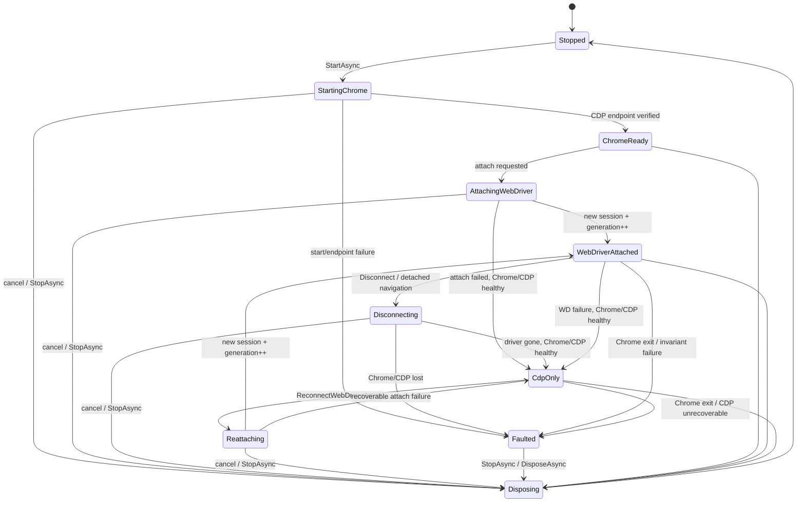

# BrowserDock development specification

- Status: research draft incorporating three independent static reviews
- Research baseline: 2026-09-08 (Asia/Seoul)
- Initial platform: Windows 11 x64, Google Chrome/Chrome for Testing, supported .NET LTS
- Implementation: MVP code and automated tests are present. [implementation.md](implementation.md) records execution results and unverified Windows acceptance coverage. No detection-site experiments were performed.
- Related document: [architecture.md](architecture.md)

## 1. Facts, decisions, and assumptions

This document uses the following labels.

- **Verified fact:** established from pinned source code or official documentation.
- **Design decision:** recommended BrowserDock structure or behavior, not necessarily the reference project's current behavior.
- **Unverified assumption:** cannot be established by static analysis and requires execution during implementation.

Success against particular sites, CAPTCHAs, WAFs, or bot-detection products is not a requirement or guarantee. “UC-compatible” describes lifecycle and call-pattern compatibility, not successful detection evasion.

## 2. Research scope and pinned versions

### 2.1 Repositories analyzed

| Project | Branch/tag | Commit SHA | Purpose |
|---|---|---|---|
| SeleniumBase | `master` | [`4ee7dfc4ae83c19385f5ac129f2cda0cfa863d80`](https://github.com/seleniumbase/SeleniumBase/commit/4ee7dfc4ae83c19385f5ac129f2cda0cfa863d80) | UC Mode and CDP Mode call paths |
| fysh711426/UndetectedChromeDriver | `master` | [`1c7042a337db3ca2beca27f440ca36deedb99e7a`](https://github.com/fysh711426/UndetectedChromeDriver/commit/1c7042a337db3ca2beca27f440ca36deedb99e7a) | Existing C# implementation comparison |
| Selenium | `trunk` | [`1303bd5282e36adb47c4605792e48a61c12752c7`](https://github.com/SeleniumHQ/selenium/commit/1303bd5282e36adb47c4605792e48a61c12752c7) | Current public/private .NET APIs and CDP scope |
| Selenium | `selenium-4.44.0` | [`da2039bd1456a161d0c284de16f9f4f179f1e8ca`](https://github.com/SeleniumHQ/selenium/commit/da2039bd1456a161d0c284de16f9f4f179f1e8ca) | Reflection compatibility for the existing C# package's pinned dependency |

GitHub issue [SeleniumBase #2563](https://github.com/seleniumbase/SeleniumBase/issues/2563) was opened on 2024-03-04. Its author observed different results between using only a patched driver in .NET and SeleniumBase UC navigation, and asked about .NET/VB bindings. It contains neither a maintainer explanation of the implementation nor an official .NET binding. It is a research starting point, not specification evidence.

### 2.2 Official documentation baseline

- ChromeDriver can attach to existing Chrome through `goog:chromeOptions.debuggerAddress`. The startup automation extension is absent in this mode, so some commands such as window resizing are unsupported. [ChromeDriver limitations](https://developer.chrome.com/docs/chromedriver/help/operation-not-supported-when-using-remote-debugging)
- Since Chrome 136, ordinary Chrome ignores `--remote-debugging-port`/`--remote-debugging-pipe` for the default user-data directory. A separate `--user-data-dir` is required; Chrome for Testing is recommended for automation. [Chrome remote-debugging changes](https://developer.chrome.com/blog/remote-debugging-port)
- CDP is browser-version-dependent rather than a stable testing standard. Selenium describes its CDP support as temporary until WebDriver BiDi is complete. [Selenium CDP documentation with .NET examples](https://www.selenium.dev/documentation/webdriver/bidi/cdp/)
- Chrome/ChromeDriver 115+ versions are matched through CfT releases and JSON endpoints. For installed Chrome, resolve the latest patch for `MAJOR.MINOR.BUILD`, then fall back to the milestone endpoint if absent. [ChromeDriver version selection](https://developer.chrome.com/docs/chromedriver/downloads/version-selection)
- As of 2026-09-08, supported LTS releases are .NET 8 and .NET 10, with scheduled end dates 2026-11-10 and 2028-11-14 respectively. [Official .NET support policy](https://dotnet.microsoft.com/en-us/platform/support/policy)

### 2.3 Independent static reviews

Three reviews cross-checked the draft on 2026-09-08: SeleniumBase call paths/permalinks; public Selenium .NET APIs and the C# reference; and state/ownership/acceptance completeness. These were static reviews, not Windows execution. Findings are incorporated here; execution-only questions remain in section 21.

## 3. Main conclusion

**Design decision:** use a hybrid architecture with **long-lived CDP control** and **replaceable, short-lived Selenium WebDriver attachments**.

Its key properties are:

1. The library launches Chrome separately and owns a unique profile and loopback DevTools endpoint.
2. Independent CDP manages Chrome/target state, navigation, runtime scripts, and recovery information.
3. When WebDriver is needed, launch a separate ChromeDriver and attach a new session through `debuggerAddress`.
4. Disconnect stops ChromeDriver and the attachment, not Chrome.
5. Reconnect creates new ChromeDriver, WebDriver, and session objects rather than reusing Selenium objects. Increment `SessionGeneration` after each success.
6. Rotate `AttachmentEpoch` as disconnect begins, invalidating old elements/leases before remote calls. Keep `SessionGeneration` separately as the successful-session number.

This preserves SeleniumBase's UC pattern—separate Chrome, debuggerAddress attachment, navigation while the driver service is stopped, and new sessions—without Python monkey-patching or private Selenium dependencies.

## 4. Actual SeleniumBase call paths

**Verified fact:** construction follows `get_driver()` → `get_local_driver()` → `undetected.Chrome(...)` → UC method monkey-patching → `extend_driver()`. Entry/UC arguments: [`browser_launcher.py` L3047-L3105](https://github.com/seleniumbase/SeleniumBase/blob/4ee7dfc4ae83c19385f5ac129f2cda0cfa863d80/seleniumbase/core/browser_launcher.py#L3047-L3105); local driver selection: [`browser_launcher.py` L3588-L3612](https://github.com/seleniumbase/SeleniumBase/blob/4ee7dfc4ae83c19385f5ac129f2cda0cfa863d80/seleniumbase/core/browser_launcher.py#L3588-L3612); final extension: [`browser_launcher.py` L6071-L6073](https://github.com/seleniumbase/SeleniumBase/blob/4ee7dfc4ae83c19385f5ac129f2cda0cfa863d80/seleniumbase/core/browser_launcher.py#L6071-L6073).

### 4.1 Initialization and binary patching

**Verified fact:** the UC branch of `browser_launcher.get_local_driver()` constructs `undetected.Chrome(...)`. It retries once with the same options only on `SessionNotCreatedException`; URL exceptions have separate macOS certificate guidance. Call site: [`browser_launcher.py` L5680-L5719](https://github.com/seleniumbase/SeleniumBase/blob/4ee7dfc4ae83c19385f5ac129f2cda0cfa863d80/seleniumbase/core/browser_launcher.py#L5680-L5719).

`undetected.Chrome.__init__()` proceeds as follows.

1. Call `Patcher.auto()` under an inter-process lock. [`undetected/__init__.py` L122-L133](https://github.com/seleniumbase/SeleniumBase/blob/4ee7dfc4ae83c19385f5ac129f2cda0cfa863d80/seleniumbase/undetected/__init__.py#L122-L133)
2. Choose the debugging port and set both `options.debugger_address` and Chrome arguments. [`undetected/__init__.py` L146-L180](https://github.com/seleniumbase/SeleniumBase/blob/4ee7dfc4ae83c19385f5ac129f2cda0cfa863d80/seleniumbase/undetected/__init__.py#L146-L180)
3. Preserve a supplied profile or create a temporary one. [`undetected/__init__.py` L181-L237](https://github.com/seleniumbase/SeleniumBase/blob/4ee7dfc4ae83c19385f5ac129f2cda0cfa863d80/seleniumbase/undetected/__init__.py#L181-L237)
4. Launch Chrome through `subprocess.Popen` before constructing Selenium Chrome WebDriver. ChromeDriver attaches through debuggerAddress instead of launching Chrome. [`undetected/__init__.py` L279-L364](https://github.com/seleniumbase/SeleniumBase/blob/4ee7dfc4ae83c19385f5ac129f2cda0cfa863d80/seleniumbase/undetected/__init__.py#L279-L364)

For a supplied executable, `Patcher.auto()` checks whether patching is needed. The managed path downloads a driver matching the browser milestone before patching. [`patcher.py` L79-L123](https://github.com/seleniumbase/SeleniumBase/blob/4ee7dfc4ae83c19385f5ac129f2cda0cfa863d80/seleniumbase/undetected/patcher.py#L79-L123)

The patch replaces two `window.cdc_*` assignment/logical-expression patterns and one `'$cdc_*';` literal with equal-length newlines or random strings. `is_binary_patched()` checks only one historical CDC marker, while `patch_exe()` can report success with zero matches, risking false positives. [`patcher.py` L201-L247](https://github.com/seleniumbase/SeleniumBase/blob/4ee7dfc4ae83c19385f5ac129f2cda0cfa863d80/seleniumbase/undetected/patcher.py#L201-L247)

**Design decision:** never patch originals in place. Cache a copy keyed by original SHA-256 and driver version; fail closed unless expected match counts are exact. Use an inter-process named mutex and atomic rename. Version recipes by ChromeDriver version range.

### 4.2 Runtime JavaScript and replacement of `get()`

**Verified fact:** `undetected.Chrome.get()` searches own/prototype globals for CDC names, registers a `Page.addScriptToEvaluateOnNewDocument` script to delete them at the next document start, then calls Selenium `get()`. [`undetected/__init__.py` L381-L439](https://github.com/seleniumbase/SeleniumBase/blob/4ee7dfc4ae83c19385f5ac129f2cda0cfa863d80/seleniumbase/undetected/__init__.py#L381-L439)

`browser_launcher` saves that UC method as `default_get` and replaces public `driver.get` with `uc_special_open_if_cf`. [`browser_launcher.py` L5913-L5928](https://github.com/seleniumbase/SeleniumBase/blob/4ee7dfc4ae83c19385f5ac129f2cda0cfa863d80/seleniumbase/core/browser_launcher.py#L5913-L5928) Thus `default_get` already includes CDC handling; it is not untouched Selenium navigation.

The replacement first makes a separate HTTP request, checking status and CAPTCHA/Cloudflare strings. Only when “special” and without `cdp_base` does it open a JavaScript tab, close the old tab, and reconnect. Otherwise it calls `default_get`. [`browser_launcher.py` L489-L557](https://github.com/seleniumbase/SeleniumBase/blob/4ee7dfc4ae83c19385f5ac129f2cda0cfa863d80/seleniumbase/core/browser_launcher.py#L489-L557)

**Design decision:** do not reproduce HTTP preflight or site-specific challenge-string classification in the MVP. A separate client's cookies/TLS/proxy state differs from Chrome, duplicates requests, and creates maintenance overhead. Callers explicitly choose `Standard` or `Detached`; heuristic policies are later extension points.

### 4.3 Navigation branches

| SeleniumBase path | Actual behavior | BrowserDock mapping |
|---|---|---|
| `get()` | HTTP precheck, then ordinary navigation or new tab/reconnect | No automatic precheck in MVP; explicit policy |
| `uc_open()` | CDP get in CDP Mode; otherwise schedule location change with setTimeout and reconnect on context exit | `NavigateAsync(url, Mode=Standard/Detached)` |
| `uc_open_with_tab()` | Open a JS/CDP tab, close the old one, select the newest window | `NavigateAsync(url, Mode=Detached, TargetPolicy=ReplaceControlled)` |
| `uc_open_with_reconnect()` | New tab, close old tab, disconnect or reconnect; newest-window selection only in reconnect branch | `NavigateAsync(url, Mode=Detached, ReconnectAfterNavigation=true/false)` |
| `uc_open_with_disconnect()` | New tab, close old tab, disconnect ChromeDriver only | `NavigateAsync(url, Mode=Detached, ReconnectAfterNavigation=false)` |
| `uc_activate_cdp_mode()` | Disconnect WebDriver; attach a separate CDP driver to the same host/port | `EnterCdpOnlyAsync()` |

Evidence:

- `uc_open`, new-tab and reconnect branches: [`browser_launcher.py` L560-L641](https://github.com/seleniumbase/SeleniumBase/blob/4ee7dfc4ae83c19385f5ac129f2cda0cfa863d80/seleniumbase/core/browser_launcher.py#L560-L641)
- `uc_open_with_disconnect`: [`browser_launcher.py` L1016-L1042](https://github.com/seleniumbase/SeleniumBase/blob/4ee7dfc4ae83c19385f5ac129f2cda0cfa863d80/seleniumbase/core/browser_launcher.py#L1016-L1042)
- Helper using `window.setTimeout`: [`js_utils.py` L401-L404](https://github.com/seleniumbase/SeleniumBase/blob/4ee7dfc4ae83c19385f5ac129f2cda0cfa863d80/seleniumbase/fixtures/js_utils.py#L401-L404)

### 4.4 Disconnect, reconnect, and session recreation

**Verified fact:** SeleniumBase disconnect attempts to stop the client/service, not the separate Chrome process. It suppresses most related exceptions and updates `_is_connected`; that flag alone does not prove shutdown or health. [`undetected/__init__.py` L532-L547](https://github.com/seleniumbase/SeleniumBase/blob/4ee7dfc4ae83c19385f5ac129f2cda0cfa863d80/seleniumbase/undetected/__init__.py#L532-L547)

`reconnect()` attempts service stop, delay, restart, and `start_session()` in order. `connect()` also starts the service and a new session. Suppressed exceptions and flag updates require independent health checks. [`undetected/__init__.py` L480-L530](https://github.com/seleniumbase/SeleniumBase/blob/4ee7dfc4ae83c19385f5ac129f2cda0cfa863d80/seleniumbase/undetected/__init__.py#L480-L530), [`undetected/__init__.py` L549-L596](https://github.com/seleniumbase/SeleniumBase/blob/4ee7dfc4ae83c19385f5ac129f2cda0cfa863d80/seleniumbase/undetected/__init__.py#L549-L596)

Python context-manager `__exit__` reconnects instead of quitting like ordinary WebDriver. [`undetected/__init__.py` L690-L695](https://github.com/seleniumbase/SeleniumBase/blob/4ee7dfc4ae83c19385f5ac129f2cda0cfa863d80/seleniumbase/undetected/__init__.py#L690-L695) Consequently `with driver:` acts as a reconnect boundary in navigation helpers.

**Design decision:** do not map this behavior to .NET `using`/`Dispose`. Dispose means final resource release; expose reconnection through explicitly named async methods.

### 4.5 CDP Mode differs from UC navigation

**Verified fact:** activation first disconnects WebDriver, then calls `cdp_util.start(host, port, ...)` on the same debugger endpoint. It maps page/element/action methods to CDP and sets `_is_using_cdp = True`. [`browser_launcher.py` L644-L752](https://github.com/seleniumbase/SeleniumBase/blob/4ee7dfc4ae83c19385f5ac129f2cda0cfa863d80/seleniumbase/core/browser_launcher.py#L644-L752), [`browser_launcher.py` L970-L1002](https://github.com/seleniumbase/SeleniumBase/blob/4ee7dfc4ae83c19385f5ac129f2cda0cfa863d80/seleniumbase/core/browser_launcher.py#L970-L1002)

`cdp_util.start()` explicitly connects to an existing debuggable session, without launching Chrome, when both host and port are supplied. [`cdp_util.py` L288-L349](https://github.com/seleniumbase/SeleniumBase/blob/4ee7dfc4ae83c19385f5ac129f2cda0cfa863d80/seleniumbase/undetected/cdp_driver/cdp_util.py#L288-L349)

These modes are distinct:

- **UC Mode:** patched ChromeDriver/WebDriver by default, temporarily stopping the service when needed.
- **CDP Mode:** persistent control by a separate CDP client while WebDriver is disconnected.

BrowserDock distinguishes `WebDriverAttached` and `CdpOnly`, rather than combining them in one stealth-mode boolean.

High-level SeleniumBase methods with CDP alternatives dispatch to CDP while disconnected. In contrast, monkey-patched raw `execute_cdp_cmd` reconnects WebDriver before calling Selenium's command. [`browser_launcher.py` L472-L480](https://github.com/seleniumbase/SeleniumBase/blob/4ee7dfc4ae83c19385f5ac129f2cda0cfa863d80/seleniumbase/core/browser_launcher.py#L472-L480), [`browser_launcher.py` L6011-L6016](https://github.com/seleniumbase/SeleniumBase/blob/4ee7dfc4ae83c19385f5ac129f2cda0cfa863d80/seleniumbase/core/browser_launcher.py#L6011-L6016) Some ordinary Selenium paths also reconnect based on connection state. [`shared_utils.py` L148-L171](https://github.com/seleniumbase/SeleniumBase/blob/4ee7dfc4ae83c19385f5ac129f2cda0cfa863d80/seleniumbase/fixtures/shared_utils.py#L148-L171)

**Unverified assumption:** SeleniumBase does not prove BrowserDock's proposed simultaneous persistent CDP/WebDriver design; its CDP Mode disconnects WebDriver first. Integration tests must check event loss and target/session conflicts during simultaneous discovery, navigation, and runtime-script management.

### 4.6 Elements and GUI input

**Verified fact:** `WebElement.uc_click()` schedules delayed DOM clicks for some tags but immediately calls `js_click()` and reconnects for others. The higher-level helper refinds elements and falls back to immediate JS click/reconnect on interception. [`undetected/webelement.py` L7-L38](https://github.com/seleniumbase/SeleniumBase/blob/4ee7dfc4ae83c19385f5ac129f2cda0cfa863d80/seleniumbase/undetected/webelement.py#L7-L38), [`browser_launcher.py` L1045-L1078](https://github.com/seleniumbase/SeleniumBase/blob/4ee7dfc4ae83c19385f5ac129f2cda0cfa863d80/seleniumbase/core/browser_launcher.py#L1045-L1078)

GUI input is separate from WebDriver/CDP and uses `pyautogui` plus an inter-process GUI lock. Windows coordinate clicks reconnect if needed and adjust using window geometry and screen scaling. [`browser_launcher.py` L1274-L1329](https://github.com/seleniumbase/SeleniumBase/blob/4ee7dfc4ae83c19385f5ac129f2cda0cfa863d80/seleniumbase/core/browser_launcher.py#L1274-L1329) CAPTCHA click flows disconnect immediately before GUI input, then reconnect. [`browser_launcher.py` L1677-L1745](https://github.com/seleniumbase/SeleniumBase/blob/4ee7dfc4ae83c19385f5ac129f2cda0cfa863d80/seleniumbase/core/browser_launcher.py#L1677-L1745)

**Design decision:** place Win32 `SendInput` in a later optional module. Require verified headed Chrome, interactive desktop, foreground window, DPI/coordinates, RDP lock state, UAC boundaries, and serialized global input. Do not provide CAPTCHA-specific or automatic solving APIs.

## 5. Existing C# implementation comparison

### 5.1 Implemented features

At the pinned commit, `Selenium.UndetectedChromeDriver` 1.1.4 implements the following.

It directly references `Selenium.WebDriver` 4.44.0. [`UndetectedChromeDriver.csproj` L47-L50](https://github.com/fysh711426/UndetectedChromeDriver/blob/1c7042a337db3ca2beca27f440ca36deedb99e7a/UndetectedChromeDriver/UndetectedChromeDriver.csproj#L47-L50)

- In-place patching of the supplied driver binary. [`Patcher.cs` L17-L79](https://github.com/fysh711426/UndetectedChromeDriver/blob/1c7042a337db3ca2beca27f440ca36deedb99e7a/UndetectedChromeDriver/Patcher.cs#L17-L79)
- Select an unused debugging port, launch Chrome separately, and attach through `ChromeOptions.DebuggerAddress`. [`UndetectedChromeDriver.cs` L85-L113](https://github.com/fysh711426/UndetectedChromeDriver/blob/1c7042a337db3ca2beca27f440ca36deedb99e7a/UndetectedChromeDriver/UndetectedChromeDriver.cs#L85-L113), [`UndetectedChromeDriver.cs` L195-L232](https://github.com/fysh711426/UndetectedChromeDriver/blob/1c7042a337db3ca2beca27f440ca36deedb99e7a/UndetectedChromeDriver/UndetectedChromeDriver.cs#L195-L232)
- Temporary/custom profiles, locale, preferences, headless runtime scripts, explicit driver paths, and some installer functionality.
- `Reconnect()` attempts service stop/restart and another `StartSession()`. [`UndetectedChromeDriver.cs` L389-L442](https://github.com/fysh711426/UndetectedChromeDriver/blob/1c7042a337db3ca2beca27f440ca36deedb99e7a/UndetectedChromeDriver/UndetectedChromeDriver.cs#L389-L442)
- The installer resolves versions through CfT `latest-patch-versions-per-build.json` and downloads artifacts. [`ChromeDriverInstaller.cs` L15-L137](https://github.com/fysh711426/UndetectedChromeDriver/blob/1c7042a337db3ca2beca27f440ca36deedb99e7a/UndetectedChromeDriver/ChromeDriverInstaller.cs#L15-L137)

### 5.2 Omissions, defects, and maintenance risks

| Area | Finding | Impact |
|---|---|---|
| Service-stop reflection | Depends on `typeof(DriverService).GetMethod("Stop", NonPublic)` | Selenium 4.44.0 has private StopAsync but no Stop. The null check throws outside the catch, so this pinned version combination deterministically fails Reconnect at that point. [4.44.0 start/dispose paths](https://github.com/SeleniumHQ/selenium/blob/da2039bd1456a161d0c284de16f9f4f179f1e8ca/dotnet/src/webdriver/DriverService.cs#L203-L278), [private `StopAsync`](https://github.com/SeleniumHQ/selenium/blob/da2039bd1456a161d0c284de16f9f4f179f1e8ca/dotnet/src/webdriver/DriverService.cs#L350-L386) |
| Session-object reuse | Calls protected StartSession again on the same ChromeDriver | StartSession initializes new SessionId/Capabilities; no reuse contract exists for the old executor/elements. [Selenium 4.44 `WebDriver.cs` L588-L610](https://github.com/SeleniumHQ/selenium/blob/da2039bd1456a161d0c284de16f9f4f179f1e8ca/dotnet/src/webdriver/WebDriver.cs#L588-L610) |
| Disconnect API | No separate Disconnect | Cannot represent a detached navigation interval with an explicit reconnect lifecycle |
| Navigation replacement | GoToUrl is an extra method, not an override; it calls Navigate().GoToUrl() | Ordinary navigation and Url setters bypass it. No SeleniumBase-style get replacement, new-tab, or detached navigation. [`UndetectedChromeDriver.cs` L241-L249](https://github.com/fysh711426/UndetectedChromeDriver/blob/1c7042a337db3ca2beca27f440ca36deedb99e7a/UndetectedChromeDriver/UndetectedChromeDriver.cs#L241-L249) |
| Runtime CDC handling | hasCdcProps and removal hooks commented out | Differs from current pre-navigation CDC removal. [`UndetectedChromeDriver.cs` L444-L475](https://github.com/fysh711426/UndetectedChromeDriver/blob/1c7042a337db3ca2beca27f440ca36deedb99e7a/UndetectedChromeDriver/UndetectedChromeDriver.cs#L444-L475) |
| Headless scripts | Registered only in GoToUrl; the first Object.defineProperty source appears syntactically invalid in static review | Injection/effects need execution testing; not performed in this research. [`UndetectedChromeDriver.cs` L251-L386](https://github.com/fysh711426/UndetectedChromeDriver/blob/1c7042a337db3ca2beca27f440ca36deedb99e7a/UndetectedChromeDriver/UndetectedChromeDriver.cs#L251-L386) |
| Patch correctness | Replaces one broad `\{window\.cdc.*?;\}` block with a marker | No per-version counts, source hash, signature, or atomicity checks; shared concurrent patching risks corruption |
| Port selection | Closes a temporary socket before Chrome binds | TOCTOU race can collide across parallel sessions. [`UndetectedChromeDriver.cs` L477-L494](https://github.com/fysh711426/UndetectedChromeDriver/blob/1c7042a337db3ca2beca27f440ca36deedb99e7a/UndetectedChromeDriver/UndetectedChromeDriver.cs#L477-L494) |
| Process I/O | Redirects Chrome stdout/stderr without consuming them | Pipes may fill during long runs |
| Shutdown/cleanup | Base disposal, browser kill, temporary-profile deletion; most exceptions swallowed | Hidden partial failures and process/port/profile leaks. [`UndetectedChromeDriver.cs` L496-L535](https://github.com/fysh711426/UndetectedChromeDriver/blob/1c7042a337db3ca2beca27f440ca36deedb99e7a/UndetectedChromeDriver/UndetectedChromeDriver.cs#L496-L535) |
| Forced termination | May taskkill all instances by executable name | Can terminate drivers owned by other sessions/applications. [`ChromeDriverInstaller.cs` L206-L252](https://github.com/fysh711426/UndetectedChromeDriver/blob/1c7042a337db3ca2beca27f440ca36deedb99e7a/UndetectedChromeDriver/ChromeDriverInstaller.cs#L206-L252) |
| Cancellation/logging | No end-to-end cancellation or structured state logs for delays/major I/O | Hard to diagnose hangs and silent recovery failure |
| CDP Mode/GUI | No pure-CDP switching or GUI layer | Only a subset of UC behavior |

### 5.3 Boundaries with current Selenium .NET

**Verified fact:** Selenium publicly exposes `ChromeOptions.DebuggerAddress` and includes it in capabilities. [`ChromiumOptions.cs` L126-L130](https://github.com/SeleniumHQ/selenium/blob/1303bd5282e36adb47c4605792e48a61c12752c7/dotnet/src/webdriver/Chromium/ChromiumOptions.cs#L126-L130), [`ChromiumOptions.cs` L544-L557](https://github.com/SeleniumHQ/selenium/blob/1303bd5282e36adb47c4605792e48a61c12752c7/dotnet/src/webdriver/Chromium/ChromiumOptions.cs#L544-L557)

`DriverService.StartAsync()`, `ProcessId`, and `ServiceUrl` are public. There is no reusable public stop; Dispose/DisposeAsync invoke private StopAsync for one-shot shutdown. [`DriverService.cs` L195-L220](https://github.com/SeleniumHQ/selenium/blob/1303bd5282e36adb47c4605792e48a61c12752c7/dotnet/src/webdriver/DriverService.cs#L195-L220), [`DriverService.cs` L292-L328](https://github.com/SeleniumHQ/selenium/blob/1303bd5282e36adb47c4605792e48a61c12752c7/dotnet/src/webdriver/DriverService.cs#L292-L328), [`DriverService.cs` L376-L412](https://github.com/SeleniumHQ/selenium/blob/1303bd5282e36adb47c4605792e48a61c12752c7/dotnet/src/webdriver/DriverService.cs#L376-L412) WebDriver.Dispose sends Quit if a session exists, then disposes the executor. [`WebDriver.cs` L729-L791](https://github.com/SeleniumHQ/selenium/blob/1303bd5282e36adb47c4605792e48a61c12752c7/dotnet/src/webdriver/WebDriver.cs#L729-L791)

Public `RemoteWebDriver(Uri, DriverOptions)` can create a session against an independently started endpoint. Vendor commands are registered by ChromeDriver/ChromiumDriver subclasses, so this path contracts only core W3C compatibility, not Chrome-specific convenience APIs. [`RemoteWebDriver.cs` L94-L132](https://github.com/SeleniumHQ/selenium/blob/1303bd5282e36adb47c4605792e48a61c12752c7/dotnet/src/webdriver/Remote/RemoteWebDriver.cs#L94-L132), [`ChromeDriver.cs` L59-L69](https://github.com/SeleniumHQ/selenium/blob/1303bd5282e36adb47c4605792e48a61c12752c7/dotnet/src/webdriver/Chrome/ChromeDriver.cs#L59-L69), [`ChromiumDriver.cs` L110-L118](https://github.com/SeleniumHQ/selenium/blob/1303bd5282e36adb47c4605792e48a61c12752c7/dotnet/src/webdriver/Chromium/ChromiumDriver.cs#L110-L118)

**Design decision:** do not reflect into StopAsync, service-process fields, or executor fields. Own ChromeDriver as a child process and create a new public RemoteWebDriver and DetachAwareCommandExecutor through public/protected extension points per attachment. Disconnect order: close admission/rotate epoch → snapshot recovery → mark executor detaching → terminate owned PID → dispose stale client. In detaching mode, DriverCommand.Quit succeeds locally as a no-op; bounded transport disposal avoids waiting on DELETE-session against a dead endpoint. Test the same contract for sync/async disposal.

ChromeDriver `/session` creation is synchronous inside the constructor and accepts no direct cancellation. [`WebDriver.cs` L50-L79](https://github.com/SeleniumHQ/selenium/blob/1303bd5282e36adb47c4605792e48a61c12752c7/dotnet/src/webdriver/WebDriver.cs#L50-L79), [`WebDriver.cs` L594-L665](https://github.com/SeleniumHQ/selenium/blob/1303bd5282e36adb47c4605792e48a61c12752c7/dotnet/src/webdriver/WebDriver.cs#L594-L665) Wrap it in dedicated work with an external deadline; on timeout/cancellation terminate only the owned driver PID and dispose within the hard cap. Mark Chrome state uncertain and recheck CDP health. Direct process ownership gives precise PID/I/O/readiness/cancellation control, at the documented cost of Selenium vendor convenience APIs.

**Unverified assumption:** forcibly stopping debuggerAddress-attached ChromeDriver should preserve external Chrome and CDP. Verify this in the first Windows acceptance test. If it fails, reconsider driver shutdown or a separate W3C client.

## 6. Official support and limitations

### 6.1 ChromeDriver attach limitations

Debugger attachment is official but not equivalent to normal driver launch. Without the automation extension, some commands fail with “operation not supported when using remote debugging.” Classify this nontransient condition as `UnsupportedAttachedCommandException`, not a retryable error.

The detach capability controls shutdown of Chrome launched by the driver. [ChromeOptions capability table](https://developer.chrome.com/docs/chromedriver/capabilities) It may be rejected for external Chrome, so BrowserDock omits it. Separate Chrome ownership, a Quit-blocking executor, and exact driver-PID termination preserve the browser; validate through AC-01.

### 6.2 CDP limitations

`/json/version` provides the browser WebSocket; `/json/list` provides page endpoints. With `--remote-debugging-port=0`, the actual port is also written to the profile's DevToolsActivePort. [CDP HTTP endpoint documentation](https://chromedevtools.github.io/devtools-protocol/)

Public Selenium ExecuteCdpCommand is a one-way command through WebDriver and cannot provide control while the driver service is disconnected. [`ChromiumDriver.cs` L287-L305](https://github.com/SeleniumHQ/selenium/blob/1303bd5282e36adb47c4605792e48a61c12752c7/dotnet/src/webdriver/Chromium/ChromiumDriver.cs#L287-L305)

Typed Selenium DevTools sessions also use the WebDriver instance's debuggerAddress and are disposed with it. [`ChromiumDriver.cs` L308-L370](https://github.com/SeleniumHQ/selenium/blob/1303bd5282e36adb47c4605792e48a61c12752c7/dotnet/src/webdriver/Chromium/ChromiumDriver.cs#L308-L370), [`ChromiumDriver.cs` L482-L512](https://github.com/SeleniumHQ/selenium/blob/1303bd5282e36adb47c4605792e48a61c12752c7/dotnet/src/webdriver/Chromium/ChromiumDriver.cs#L482-L512) The pinned source contains typed domains 150–152 with at most five-version fallback. [`DevToolsDomains.cs` L25-L46](https://github.com/SeleniumHQ/selenium/blob/1303bd5282e36adb47c4605792e48a61c12752c7/dotnet/src/webdriver/DevTools/DevToolsDomains.cs#L25-L46), [`DevToolsDomains.cs` L75-L124](https://github.com/SeleniumHQ/selenium/blob/1303bd5282e36adb47c4605792e48a61c12752c7/dotnet/src/webdriver/DevTools/DevToolsDomains.cs#L75-L124)

**Design decision:** implement a minimal independent JSON-RPC WebSocket client. Read `/json/version` and, when needed, `/json/protocol` at startup, record versions, minimize used methods/domains, and tolerate additional fields. Full typed CDP generation is a non-goal.

### 6.3 .NET and Selenium packages

The basic MVP targets `net8.0;net10.0`; section 18.3 adds net481 to Core and Legacy. Include both LTS TFMs in release CI until .NET 8 support ends on 2026-11-10; new releases from 2026-11-11 exclude EOL TFMs under the announced policy. Published packages remain available, but the EOL runtime is unsupported. The pinned Selenium source targets `net462;netstandard2.0;net8.0`. [`Selenium.WebDriver.csproj` L1-L10](https://github.com/SeleniumHQ/selenium/blob/1303bd5282e36adb47c4605792e48a61c12752c7/dotnet/src/webdriver/Selenium.WebDriver.csproj#L1-L10)

NativeAOT and aggressive trimming are outside MVP support. Selenium DevTools declares dynamic/unreferenced-code warnings; independent CDP does not eliminate the need to verify the entire WebDriver stack's AOT compatibility. [`IDevTools.cs` L24-L57](https://github.com/SeleniumHQ/selenium/blob/1303bd5282e36adb47c4605792e48a61c12752c7/dotnet/src/webdriver/DevTools/IDevTools.cs#L24-L57)

## 7. Goals and non-goals

### 7.1 Goals

- Run in C#/.NET without Python runtime, subprocesses, or packages.
- Explicitly manage Windows Chrome processes, profiles, endpoints, and driver attachments.
- Provide optional binary patching, document-start scripts, and detached navigation independently.
- Deterministic Chrome-preserving disconnect, new-session attachment, and target recovery.
- Timeouts, cancellation, parallel instances, recovery, structured logs, and cleanup from the first version.
- Use only public Selenium APIs and W3C/CDP wire protocols, without private reflection.

### 7.2 Non-goals

- Porting all SeleniumBase APIs, pytest, recorder, dashboard, proxy extensions, or assertion DSL.
- MVP support for non-Chrome browsers or non-Windows systems.
- Guaranteed detection-site/WAF/CAPTCHA success or automatic CAPTCHA solving.
- Spoofing all fingerprints or automatically disguising user agents/profiles.
- UC lifecycle management of existing remote Selenium Grid/RemoteWebDriver browsers.
- Caller-launched Chrome attachment; consider it after MVP with separate security/ownership contracts.
- Strongly typed bindings for the entire CDP protocol.
- Guaranteeing headed behavior in headless mode.
- Reusing W3C SessionIds: reconnection always creates a new session.

## 8. Architecture choice

### 8.1 Alternatives

| Criterion | UC-compatible: WebDriver-centered | CDP-centered | Recommended hybrid |
|---|---|---|---|
| Selenium API compatibility | High | Low; requires a custom element/action layer | Core W3C features through a guarded facade; raw/vendor APIs excluded from MVP |
| Control while disconnected | Limited | Natural | Retained through independent CDP |
| ChromeDriver binary patching | Central | Unnecessary | Optional capability |
| Private Selenium API risk | High in existing port approaches | None | None; replace attachments |
| Protocol stability | W3C is relatively stable | Depends on CDP version | Core W3C plus minimal CDP |
| Session recovery | Risky when recreating a session on the same object | Reestablish CDP connection | New WebDriver object/generation |
| Learning cost for existing C# users | Low | High | Moderate |
| Detection-evasion guarantee | Impossible | Impossible | Impossible |

**Design decision:** The recommended hybrid combines CDP lifecycle stability with the WebDriver API ecosystem. Binary patching is isolated behind `IDriverPatchStrategy` so driver changes do not compromise the entire browser lifecycle.

### 8.2 Module structure

```text
BrowserDock
├─ Public
│  ├─ Browser / BrowserBuilder
│  ├─ BrowserOptions / Timeouts / OwnershipPolicy
│  ├─ NavigationOptions / BrowserState / diagnostics
│  └─ TargetKey / ElementRef / WebDriverLease / IBrowserCommands
├─ Hosting
│  ├─ ChromeLocator
│  ├─ ProfileManager
│  ├─ ChromeProcessHost
│  ├─ DevToolsEndpointDiscovery
│  └─ ProcessTreeTracker
├─ Cdp
│  ├─ CdpConnection
│  ├─ TargetRegistry
│  ├─ CdpTargetSession
│  ├─ PageNavigator
│  └─ RuntimeScriptRegistry
├─ WebDriver
│  ├─ ChromeDriverProcessHost
│  ├─ WebDriverAttachmentFactory
│  ├─ DetachAwareCommandExecutor
│  ├─ AttachmentEpochGuard
│  └─ AttachedCommandCompatibility
├─ Patching
│  ├─ DriverArtifactResolver
│  ├─ DriverPatchCache
│  └─ IDriverPatchStrategy
└─ Diagnostics
   ├─ EventIds / structured logging
   ├─ HealthSnapshot
   └─ redaction

Optional package: BrowserDock.NativeInput (future)
Optional package: BrowserDock.Legacy (.NET Framework 4.8.1 / C# 7.3 Task facade)
```

## 9. Public API draft

The following API draft illustrates contracts; it is not implementation code. Names may change during implementation.

```csharp
public sealed class Browser : IAsyncDisposable
{
    public BrowserState State { get; }
    public long SessionGeneration { get; }
    public long AttachmentEpoch { get; }
    public BrowserHealthSnapshot Health { get; }

    public static ValueTask<Browser> StartAsync(
        BrowserOptions options,
        CancellationToken cancellationToken = default);

    public ValueTask<NavigationResult> NavigateAsync(
        Uri url,
        NavigationOptions? options = null,
        CancellationToken cancellationToken = default);

    public ValueTask DisconnectWebDriverAsync(
        CancellationToken cancellationToken = default);

    public ValueTask<WebDriverLease> ReconnectWebDriverAsync(
        CancellationToken cancellationToken = default);

    public ValueTask<WebDriverLease> GetWebDriverAsync(
        CancellationToken cancellationToken = default);

    public ValueTask<IReadOnlyList<BrowserTarget>> GetTargetsAsync(
        CancellationToken cancellationToken = default);

    public ValueTask SelectTargetAsync(
        TargetKey target,
        CancellationToken cancellationToken = default);

    public ValueTask EnterCdpOnlyAsync(
        CancellationToken cancellationToken = default);

    public ValueTask<ElementRef> FindAsync(
        Locator locator,
        FindOptions? options = null,
        CancellationToken cancellationToken = default);

    public ValueTask<JsonElement> ExecuteCdpAsync(
        string method,
        object? parameters = null,
        TargetKey? target = null,
        CancellationToken cancellationToken = default);

    public ValueTask StopAsync(
        ShutdownOptions? options = null,
        CancellationToken cancellationToken = default);
}

public sealed record BrowserOptions
{
    public required string ChromeBinaryPath { get; init; }
    public required DriverArtifactOptions Driver { get; init; }
    public ProfileOptions Profile { get; init; }
    public BrowserOwnership BrowserOwnership { get; init; }
    public DriverPatchMode PatchMode { get; init; }
    public BrowserTimeouts Timeouts { get; init; }
    public IReadOnlyList<string> ChromeArguments { get; init; }
}

public sealed record NavigationOptions
{
    public NavigationMode Mode { get; init; }       // Standard | Detached | CdpOnly
    public bool ReconnectAfterNavigation { get; init; }
    public NavigationWaitUntil WaitUntil { get; init; }
    public TargetKey? Target { get; init; }
    public TargetPolicy TargetPolicy { get; init; }
    public TimeSpan? ReconnectDelay { get; init; }
}

public sealed class WebDriverLease : IAsyncDisposable
{
    public IBrowserCommands Commands { get; }
    public long Generation { get; }
    public long AttachmentEpoch { get; }
}
```

API rules:

- `Browser` exposes lifecycle mutations only through async methods.
- `NavigationOptions` defaults to `Mode=Standard`, `WaitUntil=Load`, `ReconnectAfterNavigation=false`, and `TargetPolicy=CurrentControlled`. Meaningless or contradictory combinations are ignored or rejected according to the navigation matrix below.
- The MVP public API does not return raw `IWebDriver`/`IWebElement` objects. Selenium `WebElement` stores its parent driver and element ID at construction and sends commands directly to that parent, so exposing it would bypass epoch guards. [`WebElement.cs` L39-L58](https://github.com/SeleniumHQ/selenium/blob/da2039bd1456a161d0c284de16f9f4f179f1e8ca/dotnet/src/webdriver/WebElement.cs#L39-L58), [`WebElement.cs` L704-L710](https://github.com/SeleniumHQ/selenium/blob/da2039bd1456a161d0c284de16f9f4f179f1e8ca/dotnet/src/webdriver/WebElement.cs#L704-L710) `IBrowserCommands` is a guarded facade exposing only explicitly supported core W3C operations; every command and returned element is protected by the lifecycle gate and epoch checks.
- A `WebDriverLease` is valid only for the `AttachmentEpoch` in which it was issued. The epoch changes immediately when disconnect begins, so using an old lease throws `StaleAttachmentException` before any network call. `SessionGeneration` separately retains the successful session number for diagnostics.
- `ElementRef` stores its locator, frame path, target key, creation generation, and attachment epoch. It does not retain a raw element long term.
- After a session change, element operations **fail without automatic reacquisition** by default. Callers must explicitly use `ReacquireAsync()` or `ReacquireOnSessionChange`, avoiding the risk of automatically clicking a different element matching the same locator.
- Mark `ExecuteCdpAsync` as an advanced/unstable API and log the method used and Chrome protocol version.
- The MVP does not provide a sync-over-async facade.

## 10. Functional requirements

### 10.1 Startup and discovery

- **FR-001** Resolve the Chrome binary from an explicit path, then standard installation locations, and record its actual file version.
- **FR-002** The MVP requires a caller-supplied ChromeDriver path. Execute its version command before startup to validate Chrome compatibility.
- **FR-003** Automatic downloads are a future feature. Support CfT JSON endpoints, timeouts, proxies, offline caches, and SHA/provenance records when implemented. Selenium Manager is the official manager, but is an internal binding fallback; do not locate its package-internal path through reflection. [Official Selenium Manager documentation](https://www.selenium.dev/documentation/selenium_manager/)
- **FR-004** Start Chrome with `--remote-debugging-port=0` and a unique, non-default `--user-data-dir`. Resolve the actual port and browser WebSocket URL through `DevToolsActivePort` and `/json/version`.
- **FR-005** Expose DevTools only on `127.0.0.1` by default. External binding is prohibited in the MVP.
- **FR-006** Do not mark Chrome ready until the CDP health check succeeds.

### 10.2 Patching and runtime scripts

- **FR-010** `PatchMode` provides `Disabled`, `ValidateOnly`, and `BinaryCompatibility`.
- **FR-010a** The default is `Disabled`. `BinaryCompatibility` requires explicit opt-in and does not guarantee detection evasion.
- **FR-011** Patching records an original copy, version, original/result hashes, recipe ID, and match count.
- **FR-012** Each recipe declares exact expected match counts for every pattern. Fail closed if any observed count differs. Do not accept an already patched cache merely because a pattern is absent; reuse it only when its manifest, original hash, result hash, and recipe ID all match.
- **FR-013** Serialize patch-cache creation across processes and do not promote intermediate files to executable paths before success.
- **FR-014** Register runtime scripts idempotently in `RuntimeScriptRegistry` and reapply them when targets/sessions reconnect.
- **FR-015** CDC handling targets only discovered property names. A general fingerprint-spoofing bundle is outside the MVP.

### 10.3 WebDriver attachment

- **FR-020** Start ChromeDriver as a separately owned process with `--port=N` and consume stdout/stderr asynchronously. Create a session only after loopback `GET /status` returns `ready=true` and the same PID is confirmed alive. On port/bind failure, retry a bounded number of candidate ports and terminate the exact failed PID.
- **FR-021** A new attachment creates a new W3C session with the current DevTools host/port in `ChromeOptions.DebuggerAddress`. Do not set `LeaveBrowserRunning`/`detach=true`, which may be rejected when attaching to external Chrome.
- **FR-022** On attachment success, record the session ID, driver PID, service port, generation, and attachment epoch.
- **FR-023** Return typed errors and capability diagnostics for commands officially unsupported by remote-debugging attachment.
- **FR-024** CI static checks prohibit reflection on Selenium private fields/methods.
- **FR-025** Wrap session creation in a dedicated task and external deadline. On timeout/cancellation, terminate only the owned driver PID, dispose the detach-aware executor within a bound, and revalidate CDP health.
- **FR-026** The MVP exposes neither raw Selenium objects nor Chrome vendor commands. Every guarded facade call checks `WebDriverAttached` state and the current attachment epoch.

### 10.4 Navigation

- **FR-030** `Standard` performs W3C navigation through the current WebDriver attachment.
- **FR-031** `Detached` obtains the controlled target and registers runtime scripts, then disconnects WebDriver and navigates through CDP.
- **FR-032** Depending on call options, `Detached` remains CDP-only or attaches a new WebDriver session.
- **FR-033** The MVP deterministically restores only one controlled page target. If multiple ordinary page targets exist, reject detached reconnect without an explicit target with `AmbiguousTargetException`.
- **FR-034** The default URL scheme allowlist is `http`, `https`, `about`, and `data`. `file`, `chrome`, and extension URLs require explicit opt-in.
- **FR-035** The MVP does not perform separate HTTP preflight/challenge detection.
- **FR-036** The browser CDP WebSocket uses `Target.setDiscoverTargets` and `Target.setAutoAttach(flatten=true)`, or explicit attachment. Manage each controlled page as a `CdpTargetSession` with a `sessionId`, and include that session ID in page/runtime commands.
- **FR-037** Update the registry through `targetCreated`, `targetDestroyed`, and `detachedFromTarget` events. After CDP transport reconnect, enumerate and attach targets again and restore runtime script registration before navigation.

Valid navigation combinations follow. Combinations absent from this table are argument errors.

| Mode | Initial state | Behavior | Final state |
|---|---|---|---|
| `Standard` | `WebDriverAttached` | Guarded W3C navigation; ignore `ReconnectAfterNavigation` | `WebDriverAttached` |
| `Detached` | `WebDriverAttached` | Replace epoch, remove attachment, navigate the selected target through CDP | `CdpOnly` or a new `WebDriverAttached`, depending on options |
| `Detached` | `CdpOnly` | Navigate the selected target through CDP | Same state or a new attachment, depending on `ReconnectAfterNavigation` |
| `CdpOnly` | `CdpOnly`/`ChromeReady` | Navigate the selected target through CDP; reject contradictory `ReconnectAfterNavigation=true` | `CdpOnly` |
| `CdpOnly` | `WebDriverAttached` | Reject without implicitly disconnecting; caller must explicitly disconnect first | Unchanged |

`WaitUntil` provides `Commit`, `DOMContentLoaded`, `Load`, and `NetworkIdle`; mark `NetworkIdle` as best effort. Record the final URL and redirect chain in the result. Same-document navigation may lack loader events, so evaluate URL/history changes and an optional predicate. Return download starts and target closure/crashes as distinct terminal results/errors rather than mistaking them for successful loads.

### 10.5 Disconnect, reconnect, recovery

- **FR-040** Within the lifecycle gate, disconnect first atomically changes the attachment epoch and blocks new WebDriver commands, then waits for in-flight commands to finish or time out.
- **FR-041** Before disconnect, snapshot the controlled target ID, URL, title, opener, active target, and generation.
- **FR-042** Disconnect terminates only the owned ChromeDriver process and retains the Chrome process/profile/CDP connection.
- **FR-043** Enter `CdpOnly` only if CDP `Browser.getVersion` and target discovery succeed immediately after disconnect. Otherwise enter `Faulted`.
- **FR-044** Reconnect creates a new process/service/client/session rather than calling `StartSession` on an existing Selenium object.
- **FR-045** On reconnect success, finalize the new attachment epoch, atomically increment the session generation, and reconcile the controlled target. Failed session creation does not increment the generation.
- **FR-046** If Chrome has exited, do not automatically start a new instance. Fail with `BrowserExitedException` and let the caller select a recovery policy.
- **FR-047** Opt-in `RestartBrowser` recovery is a future feature, distinct from session recovery.

### 10.6 Element references

- **FR-050** Every library element wrapper carries a target key, session generation, and attachment epoch.
- **FR-051** Fail before a remote call if the current state is not `WebDriverAttached` or the attachment epoch differs. Use generation for diagnostics and explicit reacquisition decisions.
- **FR-052** Distinguish standard stale elements caused by DOM navigation from attachment/session lifecycle staleness with separate error codes. W3C element references are tied to a session and browsing context; a node is stale when it is outside the active document or disconnected. [W3C WebDriver element reference](https://www.w3.org/TR/webdriver/#elements)
- **FR-053** Explicit reacquisition reruns the original locator/frame chain and returns a new wrapper. Do not silently update the existing wrapper.

## 11. State model



Maintain separate health dimensions.

| Dimension | States |
|---|---|
| Chrome process | `NotStarted`, `Running`, `Exited` |
| CDP transport | `Disconnected`, `Connecting`, `Connected`, `Recovering`, `Failed` |
| WebDriver attachment | `None`, `StartingProcess`, `CreatingSession`, `Attached`, `Stopping`, `Failed` |
| profile | `CallerOwned`, `LibraryTemporary`, `LibraryPersistent` |

Change `BrowserState` only within the lifecycle gate. Log the previous/next states, operation ID, generation, attachment epoch, and cause. Cancellation/`StopAsync` during transient states converges on `Disposing`. If an attached command fails while Chrome/CDP remain healthy, invalidate the epoch and enter `CdpOnly`; otherwise enter `Faulted`. Handle temporary CDP socket loss as `Recovering` in the health dimension, while lifecycle commands wait at the gate until recovery or timeout completes.

## 12. Sequences

### 12.1 Startup

```mermaid
sequenceDiagram
    participant App
    participant Uc as Browser
    participant Chrome
    participant CDP
    participant Driver as ChromeDriver
    participant WD as WebDriver client

    App->>Uc: StartAsync(options, ct)
    Uc->>Uc: Validate profile/ownership/version/patch
    Uc->>Chrome: launch --user-data-dir --remote-debugging-port=0
    Uc->>Chrome: read DevToolsActivePort
    Uc->>CDP: connect browser websocket
    CDP->>Chrome: discover/auto-attach targets; obtain sessionId
    Uc->>Driver: start --port=N; poll GET /status ready=true
    Uc->>WD: new session(debuggerAddress)
    WD->>Driver: POST /session
    Driver->>Chrome: attach to existing browser
    Uc-->>App: WebDriverAttached, generation=1, epoch=1
```

### 12.2 Detached navigation and reconnect

```mermaid
sequenceDiagram
    participant App
    participant Uc as Browser
    participant CDP
    participant Driver as ChromeDriver
    participant Chrome

    App->>Uc: NavigateAsync(url, Detached+Reconnect, ct)
    Uc->>Uc: acquire lifecycle gate; epoch++; block new WD commands
    Uc->>CDP: select/create controlled target session
    Uc->>CDP: add runtime scripts; snapshot target/session
    Uc->>Uc: put executor in detaching mode
    Uc->>Driver: terminate owned driver process
    Uc->>Uc: bounded dispose stale client/executor (Quit=no-op)
    Uc->>CDP: Page.navigate(url, target sessionId)
    CDP->>Chrome: wait requested lifecycle milestone
    Uc->>Driver: start new process
    Uc->>Driver: create new session(debuggerAddress)
    Uc->>CDP: re-enumerate/attach/activate controlled target
    Uc->>Uc: generation++; commit new epoch; release gate
    Uc-->>App: NavigationResult(new generation/epoch)
```

If target recovery is ambiguous, the MVP fails instead of selecting an arbitrary tab. SeleniumBase's selection of the last window handle is reference behavior only and is not copied into the contract.

## 13. Profile, port, and process ownership

### 13.1 Ownership table

| Resource | Default owner | Shutdown policy |
|---|---|---|
| Chrome process/tree | Library | Request graceful shutdown; on timeout, kill only that PID tree |
| ChromeDriver process | Library/attachment | Always clean up on disconnect and final shutdown |
| Temporary profile | Library | Delete only after Chrome exit is confirmed and the marker matches |
| Custom profile | Caller | Never delete; release only the exclusive lock |
| Patch cache | Library, persistent | Never delete while running; separate pruning policy |
| CDP socket/event loop | Library | Bounded drain on stop, then dispose |

### 13.2 Safety rules

- Never use the default Chrome profile. Always use a separate path to comply with Chrome 136+ policy and protect user data.
- Create an ownership marker containing the library ID and a nonce in temporary profiles. Recursively delete only when the marker, canonical path, and allowed temporary root all match.
- Do not start with a user profile unless an interprocess exclusive lock is acquired. Profile sharing is unsupported.
- Use `--remote-debugging-port=0` and `DevToolsActivePort` to eliminate the Chrome port TOCTOU race.
- A short bind-launch race remains for the ChromeDriver service port if no stable public API reserves it through the OS. Retry new ports within a bounded count and never terminate another PID.
- Prohibit process-name-based `taskkill /im`. Validate the PID acquired at startup together with its creation time and canonical executable path.
- Consume Chrome stdout/stderr asynchronously or redirect them to an explicit null sink to prevent pipe deadlocks.
- Do not apply a kill-on-close Job Object to Chrome when browser keep-alive is requested. Verify Windows process-tree cleanup for the default library-owned shutdown policy.

## 14. Timeouts, cancellation, concurrency, recovery, and logging

### 14.1 Timeouts and cancellation

`BrowserTimeouts` separates at least the following:

- `ChromeStart`
- `DevToolsEndpointDiscovery`
- `CdpConnect`
- `DriverProcessStart`
- `WebDriverSessionCreate`
- `Navigation`
- `DisconnectDrain`
- `Reconnect`
- `GracefulShutdown`
- `ForceKillWait`
- `ProfileCleanup`

Defaults and upper-bound contracts follow. If the caller's overall deadline is shorter, no stage may exceed the remaining time.

| Stage | Default timeout |
|---|---:|
| Chrome start | 20 seconds |
| DevTools endpoint discovery | 10 seconds |
| CDP connect/recover | 10 seconds |
| ChromeDriver process readiness | 10 seconds |
| WebDriver new session | 30 seconds |
| Navigation | 60 seconds |
| In-flight disconnect drain | 2 seconds |
| Entire reconnect operation | 45 seconds |
| Graceful shutdown | 5 seconds |
| Exact PID force-kill wait | 5 seconds |
| Profile cleanup | 5 seconds |

Run cleanup in a separate scope that caller cancellation cannot interrupt, with a total hard cap of 10 seconds. If the cap is exceeded, record owned PIDs/ports/profiles and incomplete stages in diagnostics and finish in `Faulted`.

Every library async API accepts `CancellationToken`. Cancellation has these contracts:

- Cancellation during startup: clean up partially owned resources in reverse order and enter `Stopped`, or `Faulted` if cleanup fails.
- Cancellation during navigation: cancelling a CDP command does not guarantee reversal of navigation already sent to the browser. Record `BrowserMayHaveAdvanced=true` in the result.
- Immediate cancellation of synchronous Selenium commands is not guaranteed. After command timeout, terminate the attachment process and transition to `CdpOnly` or `Faulted`.
- Use cancellable delays rather than `Thread.Sleep` in lifecycle implementation.

### 14.2 Concurrency

- Serialize start/stop/navigation/disconnect/reconnect for one `Browser` through a single async lifecycle gate.
- Mutations on the same WebDriver attachment are not guaranteed parallel-safe. Document that one `WebDriverLease` must not be shared across threads. Selenium also recommends a new WebDriver instance per test. [Selenium state isolation](https://www.selenium.dev/documentation/test_practices/encouraged/avoid_sharing_state/)
- CDP requests may be multiplexed by numeric ID, but target mutations preserve order through per-target queues.
- Event callbacks do not execute user code within the transport read loop or lifecycle lock. Deliver them through a bounded channel and expose its overflow policy in logs.
- Separate `Browser` instances must support parallel execution. Use interprocess locks only for shared patch/cache/profile resources.

### 14.3 Error model and recovery

Minimum error categories:

- `ConfigurationError`
- `VersionMismatch`
- `PatchMismatch`
- `ChromeStartFailure`
- `DevToolsEndpointFailure`
- `ChromeExited`
- `DriverProcessFailure`
- `WebDriverSessionFailure`
- `UnsupportedAttachedCommand`
- `AmbiguousTarget`
- `TargetClosed`
- `TargetCrashed`
- `StaleAttachment`
- `AttachmentLost`
- `StaleDomElement`
- `OperationTimedOut`
- `CleanupIncomplete`

Each exception/result includes the operation ID, state, generation, retryability, cause, and a redacted diagnostic snapshot. Do not unconditionally catch and ignore errors. Aggregate multiple cleanup errors while preserving the original user exception.

Recovery levels:

1. Reconnect the CDP socket once: verify that the Chrome process and endpoint are unchanged.
2. Recreate the WebDriver attachment: only while Chrome/CDP are healthy.
3. Restart Chrome: never automatically; reserve this for a future opt-in policy.

### 14.4 Logging

Use the `Microsoft.Extensions.Logging` abstractions and structure these events:

- Chrome/profile/driver version resolution
- Patch recipe, match count, and hash prefix
- Process start/exit and ownership
- Endpoint discovery and CDP connect/detach/reconnect
- State transitions and generation changes
- Navigation mode and milestones
- Timeout/cancellation/recovery stages
- Cleanup results and remaining PIDs/ports/profiles

Default logs exclude cookies, authorization headers, local/session storage, page source, script results, and full URLs including queries/fragments. URL logging and CDP payload tracing require explicit opt-in and provide redaction hooks. There is no external telemetry.

## 15. Version compatibility policy

- Require Windows 11 x64 and Chrome Stable in the CI matrix. Standard Windows 10 reached end of support on 2025-10-14 and is not required; add Windows 10 22H2 ESU/LTSC only when a separate compatibility matrix and support conditions are established. [Windows release health](https://learn.microsoft.com/en-us/windows/release-health/release-information)
- Use exact CfT Chrome+ChromeDriver pairs as reproducible baseline fixtures.
- Support system Chrome on M115+ when an exact `MAJOR.MINOR.BUILD` resolver is available. An arbitrary driver sharing only the major version fails by default rather than merely producing a warning.
- Test Chrome Stable and Stable-1 for releases, provided their distribution artifacts remain available from official endpoints.
- Mark Chrome Beta/Dev/Canary and custom Chromium as best effort and unsupported.
- Bound the Selenium.WebDriver dependency compatibility range by minor version and run start, attach, disconnect, reconnect, and dispose tests in dependency-update CI.
- Maintain Chrome-major-specific contract tests for the CDP method list and tolerant DTOs. On protocol version mismatch, check required method availability instead of always continuing after a warning.
- Run CI on the latest servicing patches of .NET 8 and .NET 10. Exclude end-of-support runtimes according to the date-based release policy in §6.3.

## 16. Licensing and distribution constraints

**Verified facts:** SeleniumBase at the pinned commit is licensed under MIT. [SeleniumBase LICENSE](https://github.com/seleniumbase/SeleniumBase/blob/4ee7dfc4ae83c19385f5ac129f2cda0cfa863d80/LICENSE#L1-L20) Selenium uses Apache-2.0. [Selenium LICENSE](https://github.com/SeleniumHQ/selenium/blob/1303bd5282e36adb47c4605792e48a61c12752c7/LICENSE#L2-L34) The existing C# implementation declares `GPL-3.0-only` in its project metadata. [`UndetectedChromeDriver.csproj` L3-L14](https://github.com/fysh711426/UndetectedChromeDriver/blob/1c7042a337db3ca2beca27f440ca36deedb99e7a/UndetectedChromeDriver/UndetectedChromeDriver.csproj#L3-L14)

**Design decisions:**

- Use the existing GPL C# implementation only for behavioral comparison; do not copy or translate its code. Because GPL sources have already been reviewed, do not assert a legally defined clean-room process. Maintain an independent, non-copying implementation process and provenance records based on this specification and official protocols/APIs.
- If substantial SeleniumBase source is copied, include its MIT copyright/permission notice in distributions. Prefer independent behavioral design with documented sources.
- Include the Selenium package's Apache-2.0 LICENSE/NOTICE obligations in the NuGet distribution checklist.
- Do not bundle Chrome/ChromeDriver/CfT artifacts in NuGet. Default to user-installed Chrome and a driver path obtained separately from official sources. Before adding an automatic downloader, obtain legal review of each artifact's distribution terms and notices.
- Avoid package names/descriptions that imply an official SeleniumBase, Chrome, or ChromeDriver product, and explicitly identify this as an unofficial compatibility project.

This section is not legal advice; a separate license review is required before the first public distribution.

## 17. Security and responsible use

- Remote-debugging endpoints are loopback-only and use random ports and separate profiles.
- Treat endpoints, profiles, cookies, and CDP payloads as sensitive information.
- Prohibit attachment to the user's default Chrome profile. Attaching to externally launched Chrome is outside the MVP; future support requires explicit opt-in, an endpoint authentication boundary, and a contract protecting unowned processes.
- Use downloaded drivers only after validating the official HTTPS source, expected archive entry, hash records, and protection against ZIP path traversal.
- Validate executable paths and ownership before patching; do not attempt administrator elevation.
- Document that callers are responsible for complying with site terms, robots policies, authentication/privacy protections, and applicable laws.
- Do not use even possible detection reduction as a general product guarantee. Results depend on Chrome, driver, site, version, and environment.

## 18. MVP and future features

### 18.1 MVP

1. Windows 11 x64, headed Chrome, `net481;net8.0;net10.0` (modern .NET only within each runtime's official support period)
2. Explicit Chrome/ChromeDriver paths and strict version validation
3. Temporary/caller-owned profiles and explicit ownership
4. `remote-debugging-port=0` endpoint discovery and an independent minimal CDP client separating browser and target sessions
5. Optional, versioned, copy-on-write binary compatibility patches
6. New WebDriver attachment creation, a detach-aware executor, and attachment epoch guards
7. `Standard`, `Detached`, `CdpOnly` navigation
8. Chrome survival after disconnect and reconnect through a new session
9. Recovery of one controlled page target
10. Locator-based element reacquisition and stale-generation rejection
11. Timeouts, cancellation, structured logging, and partial-failure cleanup
12. Automation of the acceptance tests below

### 18.2 Future features

- Automatic CfT driver/browser resolution and offline cache
- Deterministic recovery of multiple page/window/iframe targets
- CDP event subscriptions, network observation, and download management
- Proxy and authenticated-proxy support
- Opt-in browser restart and state migration
- Win32 native-input package for headed environments
- Experimental headless/new-headless support, without guarantees equivalent to headed mode
- Replacement of some CDP functionality when WebDriver BiDi is sufficiently stable
- Selenium Grid/remote-host research
- Research into attachment to caller-launched external Chrome
- Dedicated VB.NET samples and usability improvements

### 18.3 .NET Framework 4.8.1 / C# 7.3 extension

- Build the shared core for `net481;net8.0;net10.0`, sharing lifecycle, CDP, epoch, and cleanup contracts. Do not remove or change existing .NET 8/10 APIs to support `net481`.
- `BrowserDock.Legacy` provides `Task`-based APIs and ordinary enum/options/result types. C# 7.3 callers do not need records, init/required, ValueTask, or IAsyncDisposable. Copy settings and collections before asynchronous work starts.
- Await `StopAsync` or `DisposeAsync` within `try/finally` for cleanup. Do not provide a synchronous facade that blocks UI threads. Internal library awaits do not capture the caller's SynchronizationContext.
- Provide Framework-specific timeout/process/file/HTTP/Windows-version/argument handling and WebSocket ArraySegment paths. Test the public executor contract with Selenium 4.44.0's net462 asset as well.
- Framework-specific tests run the .NET 10 fixture server in a separate process. Running the Framework product does not require a modern .NET runtime.
- Run shared contract tests on the actual net481 runtime in Windows CI, and separately run browser/leak tests in an interactive Windows 11 x64 environment. A successful build alone does not establish runtime support.
- .NET Framework 4.8, dedicated VB.NET APIs/samples, Windows 10, and ARM64 support are outside this scope. Follow [Framework guide](framework481.md) for installation and binding settings.

## 19. Implementation sequence

1. **Legal and fixture preparation:** independent, non-copying implementation process, notices, CfT test pair, and local test pages
2. **State/ownership foundation:** state machine, generation/attachment epoch, lifecycle gate, typed errors, and logging event IDs
3. **Chrome hosting:** profile marker/lock, process start, `DevToolsActivePort`, process tree cleanup
4. **Minimal CDP control plane:** browser WebSocket, target session registry, minimal Page/Runtime/Target commands, and reconnect
5. **Driver artifacts/patching:** version checks, immutable originals, atomic cache, and recipe fixture tests
6. **WebDriver attachment:** separate ChromeDriver process/readiness, session creation through public Selenium APIs only, guarded facade, and detach-aware cleanup
7. **Navigation/reconnect:** Standard/Detached/CdpOnly sequences and single-target recovery
8. **Element generation:** block raw leases, `ElementRef`, and explicit reacquisition
9. **Reliability:** cancellation, fault injection, parallelism, and leak tests
10. **Documentation/packaging:** support matrix, known limitations, license/NOTICE, and no-detection-guarantee language

Do not implement patching or navigation-bypass features before steps 1–3 are complete. Resource ownership and cleanup on failure are the first risks to address.

## 20. Verifiable acceptance criteria

### AC-01 Chrome survives disconnect — highest priority

- Start library-owned headed Chrome and WebDriver.
- Record the browser PID/creation time, DevTools endpoint, and controlled target.
- Test a matrix of omitted/`true` `detach` and DELETE-session requests/direct driver-PID termination. If `detach=true` is explicitly rejected, record that result and whether Chrome survives. The product path omits `detach`, blocks Quit, and terminates the driver PID.
- After `DisconnectWebDriverAsync()`, the ChromeDriver PID must exit within 5 seconds.
- The original Chrome PID/creation time must remain unchanged and alive, and CDP `Browser.getVersion` and target queries must succeed.
- These conditions must remain true after at least 30 seconds in `CdpOnly`.
- No other Chrome/ChromeDriver process may be terminated.

### AC-02 Session recovery — highest priority

- Create a URL, cookie/localStorage values, and a DOM marker on a local test page.
- Disconnect, then reconnect.
- Preserve the Chrome PID, profile path, and DevTools endpoint; WebDriver SessionId and `SessionGeneration` must change.
- A new guarded WebDriver lease must read the current URL, cookie/localStorage values, and DOM marker and perform navigation/click operations.
- Do not hide reconnect failures; return stage-specific typed errors.

### AC-03 Stale element references — highest priority

- Obtain an element wrapper and guarded lease at generation N/epoch E.
- Start disconnect and call the old wrapper and lease before reconnect completes. Both must throw `StaleAttachmentException` before any remote request.
- Disconnect/reconnect to create generation N+1.
- Click/read on the old wrapper must throw `StaleAttachmentException` before any network call.
- Explicit `ReacquireAsync()` must return an N+1 wrapper whose operations succeed.
- DOM replacement within the same session must be classified separately as `StaleDomElement`.

### AC-04 Resource leaks — highest priority

- Repeat start → detached navigation → disconnect → reconnect → stop at least 100 times.
- No owned ChromeDriver process or service port may remain 5 seconds after each iteration.
- After final stop, no library-owned Chrome process tree, CDP socket, background task, event subscription, or file handle may remain.
- Delete temporary profiles within 10 seconds and release profile locks within 5 seconds. Chrome may itself change caller-owned profiles, but the library must not directly write, reset, or delete outside its ownership marker/configuration area; preplaced sentinels must survive.
- After warm-up, final process handles must remain within baseline `+5`, threads within `+2`, and library background tasks at `0`. Median private bytes over the final 20 iterations must not exceed warm-up baseline `+20%`. If environmental variation causes failure, record measurements and the rationale for threshold changes in release records.

### AC-05 Port/profile parallelism

- Start 20 instances in parallel under the same user account.
- Chrome DevTools endpoints and ChromeDriver service ports must not collide.
- A second attempt to use the same persistent profile must fail quickly with an explicit error.
- The patch cache must produce exactly one valid result and leave no partial files.

### AC-06 Cancellation and fault injection

- Cancel during Chrome startup, endpoint discovery, driver startup, session creation, navigation, reconnect, and cleanup.
- Clean up owned processes/profiles/locks according to policy and reach `Stopped` or a diagnosable `Faulted` state.
- Inject ChromeDriver crashes, Chrome crashes, and CDP socket drops separately; do not exceed the defined recovery level.
- If synchronous new-session creation exceeds its deadline, clean up the owned driver PID and transport within the 10-second cleanup hard cap and report Chrome/CDP health.

### AC-07 Attachment command limitations

- Run commands with known official limitations, such as window resizing, in the matrix.
- Record actual support per Chrome major and map unsupported errors to typed categories.
- Do not document ordinary ChromeDriver-launch results as debuggerAddress-attachment results.

### AC-08 Patch regression

- Pin the original hash, recipe, expected match counts, and result hash for each supported ChromeDriver fixture.
- Reuse an already patched cache idempotently when its manifest and result hash match.
- Fail before execution for unknown binaries, corrupt archives, or any pattern whose observed match count differs from the recipe's exact expected count.
- Preserve the original vendor binary byte for byte.

### AC-09 Simultaneous CDP and WebDriver connections

- Start and stop an independent browser CDP WebSocket and WebDriver attachment together 100 times.
- Observe target creation/closure/navigation from both connections, with no missing events, incorrect sessionId dispatch, or uncontrolled-target selection.
- After dropping and recovering the CDP socket, complete controlled-target enumeration/attachment and runtime-script registration before navigation.
- If concurrent control conflicts occur, abandon the long-lived simultaneous-CDP assumption and select a fallback design that narrows CDP observation while WebDriver is attached.

### AC-10 Detection-related language

- Results from specific external detection sites are not release gates.
- Even optional smoke results must not be expressed as guarantees; record Chrome/driver/library/OS versions and execution conditions alongside them.

## 21. Unverified assumptions and open questions

### 21.1 Assumptions that must be verified first

1. On Windows, do Chrome and its DevTools endpoint survive termination of a ChromeDriver process attached to externally launched Chrome through debuggerAddress?
2. In what order does a new ChromeDriver process/session expose existing controlled tabs as window handles? Is this consistent across Chrome/driver majors?
3. Is current-window selection in a new WebDriver session deterministic immediately after CDP `Target.activateTarget`? If not, is enforcing one target sufficient?
4. After terminating the driver process first, does disposing the stale WebDriver object clean up only the executor, without a Chrome shutdown command or prolonged hang?
5. Do both ordinary Chrome 136+ and CfT reliably create `DevToolsActivePort` with `remote-debugging-port=0` and a non-default profile?
6. Does the optional patch recipe match exactly once in current/previous Stable ChromeDriver and preserve executability?
7. What effects/errors do SeleniumBase and the existing C# implementation's runtime CDC removal and headless scripts produce in current Chrome? They were not executed in this research.
8. Can an independent CDP client and ChromeDriver perform target discovery/navigation/runtime scripting concurrently without conflicts or event loss?

### 21.2 Product decisions still required

- Package/license goals. Legal review is required for the independent, non-copying process excluding GPL code and the feasibility of a permissive license.
- Whether requiring a user-supplied driver path is acceptable for the MVP, or whether to move the CfT resolver into the MVP.
- Whether final `DisposeAsync()` may leave the browser alive. If allowed, an explicit `DetachBrowserAsync()` contract must transfer profile and Chrome ownership to the caller.

## 22. Research limitations

- Source call paths and official documentation were reviewed, but Chrome/ChromeDriver were not run on Windows during this research.
- No success tests targeted external detection sites, CAPTCHA, or WAF systems.
- ChromeDriver binary patterns were not checked against actual Stable artifacts.
- The existing C# implementation's NuGet binary was not executed. Reflection-failure findings come from static comparison of pinned source and Selenium 4.44.0 source.
- Chrome, ChromeDriver, Selenium, and CDP change rapidly. Refresh this document's source SHAs, official support policies, and CfT matrix before implementation and every release.
